## 핵심 요약

::: {.summary-grid}
::: {.summary-card}
**Runtime**

C++ `io_uring` 기반 web runtime으로 portfolio 정적 파일 서버 운영
:::

::: {.summary-card}
**Platform**

Proxmox VM 위 3 control-plane + 2 worker native Kubernetes HA cluster
:::

::: {.summary-card}
**Deploy**

GitHub Actions가 GHCR image push 후 GitOps repo의 image tag를 갱신
:::

::: {.summary-card}
**Operate**

GitHub Pages를 상세 문서 기준 경로로 두고 과거 RuntimeWeb 경로는 사용 종료 안내로 전환
:::
:::

| 항목 | 내용 |
|---|---|
| 문서 역할 | C++ 런타임과 홈랩 Kubernetes 운영 경로를 연결한 증거 정리 |
| 현재 공개 문서 | `mint-cocoa.github.io/portfolio` |
| 사용 종료 안내 | `portfolio.mintcocoa.cc` |
| 준비할 공개 앱 | `k8s-status`(Gatus), `dropapp`(PairDrop) |
| 이미지 레지스트리 | GHCR |
| 배포 제어 | GitOps + Argo CD automated sync |
| 실행 환경 | Proxmox VM 기반 native Kubernetes HA cluster |
| 기준 공개 경로 | `mint-cocoa.github.io/portfolio` |

## 개요

이 문서는 `iouring-runtime` 위에서 portfolio 정적 파일 서버를 만들고, 컨테이너
이미지, GitHub Actions, GitOps, Argo CD, Kubernetes Ingress까지 연결한 과정을
정리한 운영 포트폴리오입니다. 과거 목표는 단순한 예제 서버가 아니라, 개인 도메인에서
접근 가능한 실사용 경로를 C++ 런타임 기반으로 배포하는 것이었습니다. 현재 상세 문서의
기준 공개 경로는 GitHub Pages이며, `portfolio.mintcocoa.cc`는 사용 종료 안내 경로로 분리했습니다.

현재 검증된 live workload는 `portfolio`입니다. 추가 공개 ingress는
`k8s.mintcocoa.cc`와 `dropapp.mintcocoa.cc`를 중심으로 정리하고,
`webhook.mintcocoa.cc`는 공개 포트폴리오 경로에서 제외합니다.

- `portfolio`: 과거 C++ 정적 파일 서버로 서빙하던 포트폴리오 문서 경로, 현재는 사용 종료 안내
- `k8s-status`: Gatus 기반 공개 status page 후보
- `dropapp`: PairDrop 기반 브라우저 파일 전송 앱 후보

## 문제 정의

기존 포트폴리오 문서는 게임 서버와 클라이언트 구현 중심이었습니다. 하지만 서버
런타임을 실제 운영 환경까지 연결했다는 증거는 별도로 정리되어 있지 않았습니다.
이번 작업의 핵심 질문은 다음과 같았습니다.

1. 직접 만든 C++ io_uring 런타임이 HTTP 앱을 안정적으로 서빙할 수 있는가?
2. 앱을 이미지화하고, GHCR, GitOps, Argo CD로 자동 배포할 수 있는가?
3. 배포 결과를 내 도메인에서 실제 서비스로 노출할 수 있는가?
4. 관리, edge, VM, workload, delivery, storage 계층을 분리해 운영할 수 있는가?

## 전체 구조

```{mermaid}
flowchart LR
    Internet[Internet] --> Router[Home Router]
    Router --> Edge[Mini PC Edge Proxy<br/>172.30.1.27]
    Edge --> LB[MetalLB LoadBalancer IP<br/>172.30.1.240]
    LB --> Ingress[ingress-nginx]
    Ingress --> Service[Kubernetes Service]
    Service --> Pod[Pod]
```

홈랩은 관리, edge, 가상화, workload, delivery, storage 계층을 분리해 운영합니다.

| Layer | Component | Address | Role |
|---|---|---:|---|
| Management Plane | Odroid | `172.30.1.83` | Terraform, Ansible, Kubespray, kubectl, Helm, GitOps bootstrap |
| Edge Plane | Mini PC | `172.30.1.27` | External HTTPS entrypoint, Kubernetes API HAProxy |
| Virtualization Plane | Proxmox VE | `172.30.1.12` | VM runtime, snapshots, backup base |
| Workload Plane | Kubernetes VMs | `172.30.1.231-235` | Application and platform workloads |
| Delivery Plane | GitHub Actions, GHCR, Argo CD | external + cluster | Image build, registry, GitOps deployment |
| Storage Plane | OMV VM | `172.30.1.52` | NFS backing store for Kubernetes PVCs |

현재 Kubernetes cluster는 Proxmox VM 위에 Kubespray로 설치한 native Kubernetes HA
cluster입니다. 과거 `k3s` 명칭이 남아 있는 Terraform 경로가 있지만, 현재 검증된
상태는 단일 control-plane k3s가 아닙니다.

## 배포 흐름

```{mermaid}
flowchart LR
    Dev[Developer PC] --> GitHub[GitHub push]
    GitHub --> Actions[GitHub Actions]
    Actions --> GHCR[GHCR image push]
    GHCR --> GitOps[GitOps repository update]
    GitOps --> Argo[Argo CD sync]
    Argo --> Rollout[Kubernetes rollout]
    Rollout --> Exposure[ingress-nginx + MetalLB exposure]
```

배포 흐름은 애플리케이션 코드와 운영 매니페스트를 분리했습니다.

- 앱 코드는 `mint-cocoa/iouring-runtime` 또는 `mint-cocoa/portfolio`에 둡니다.
- 컨테이너 이미지는 `ghcr.io/mint-cocoa/<app>:<GITHUB_SHA>`로 푸시합니다.
- GitHub Actions가 GitOps repo의 Helm values를 해당 SHA로 갱신합니다.
- Argo CD가 변경된 chart를 감지해 클러스터에 반영합니다.

현재 검증된 Argo CD Applications는 `home-root`, `metallb-config`,
`nfs-subdir-external-provisioner`, `prometheus`, `grafana`, `demo-whoami`,
`portfolio`이며 모두 `Synced` / `Healthy` 상태입니다.

## Kubernetes HA Cluster

현재 workload plane은 Proxmox VM 위에서 동작하는 5-node native Kubernetes HA
cluster입니다.

| Host | IP | Role | Status | Runtime |
|---|---:|---|---|---|
| `k8s-cp-1` | `172.30.1.231` | control-plane | Ready | containerd |
| `k8s-cp-2` | `172.30.1.232` | control-plane | Ready | containerd |
| `k8s-cp-3` | `172.30.1.233` | control-plane | Ready | containerd |
| `k8s-worker-1` | `172.30.1.234` | worker | Ready | containerd |
| `k8s-worker-2` | `172.30.1.235` | worker | Ready | containerd |

검증된 버전은 다음과 같습니다.

```text
Client Version: v1.34.7
Server Version: v1.35.4
```

기본 구성은 Calico CNI, CoreDNS, NodeLocal DNS, kube-proxy, metrics-server를
포함합니다. 세 개의 control-plane node가 API server, scheduler,
controller-manager, etcd를 담당하고, worker node가 application/platform workload를
수용합니다.

## 현재 Workloads

현재 live cluster에서 검증된 workload는 다음과 같습니다.

| Namespace | Workload | Purpose | Status |
|---|---|---|---|
| `argocd` | `argocd-*` | GitOps controller | Running |
| `demo` | `demo-whoami` | Ingress demo app | Running |
| `ingress-smoke` | `echo` | Ingress smoke test | Running |
| `monitoring` | `prometheus-server` | Metrics collection | Running |
| `monitoring` | `grafana` | Dashboard UI | Running |
| `portfolio` | `portfolio` | Portfolio site | Running |
| `storage-system` | `nfs-subdir-external-provisioner` | Dynamic NFS PV provisioning | Running |

`k8s-status`와 `dropapp`은 공개 ingress에 연결할 OSS 앱 후보입니다. 현재
live cluster에는 아직 배포하지 않았기 때문에 포트폴리오에서는 검증된 운영
workload가 아니라 다음 배포 대상으로 구분합니다.

## C++ 런타임 기반 웹 앱

`iouring_runtime_web`는 `WebServer`, 라우터, request context, response builder,
streaming upload API를 제공합니다. 웹 앱은 다음과 같은 형태로 작성했습니다.

```cpp
iouring_runtime::web::WebServer server(config);

server.Get("/healthz", [](RequestContext& ctx) {
    ctx.response.ContentType("text/plain; charset=utf-8")
        .Body("ok")
        .Send();
});

server.Get("/", [&](RequestContext& ctx) {
    ServeStaticFile(ctx, static_root, "index.html");
});
```

중요한 점은 단순히 TCP 서버를 만든 것이 아니라, HTTP 라우팅, 정적 파일 서빙,
raw body upload, JSON API, 인증 헤더 처리까지 실제 웹 앱에 필요한 표면을
구현했다는 점입니다.

## k8s-status

`k8s-status`는 Gatus 기반 status page로 구성할 예정입니다. Kubernetes ingress와
공개 서비스 상태를 한눈에 볼 수 있어서 `k8s.mintcocoa.cc`의 성격에 잘 맞습니다.

| 항목 | 내용 |
|---|---|
| OSS | Gatus |
| 공개 경로 | `k8s.mintcocoa.cc` |
| 역할 | portfolio, dropapp, Ops API, Prometheus 등 public endpoint 상태 표시 |
| 배포 상태 | 후보 선정, live cluster 배포 전 |

## dropapp

`dropapp`은 PairDrop 기반 브라우저 파일 전송 앱으로 구성할 예정입니다.
`dropapp.mintcocoa.cc`라는 도메인과 서비스 목적이 직접 맞고, 공개 데모로 확인하기
좋은 작은 OSS 앱입니다.

| 항목 | 내용 |
|---|---|
| OSS | PairDrop |
| 공개 경로 | `dropapp.mintcocoa.cc` |
| 역할 | 브라우저 기반 파일 전송 데모 |
| 배포 상태 | 후보 선정, live cluster 배포 전 |

## 컨테이너 이미지

추가 공개 앱은 직접 만든 이미지를 새로 빌드하기보다 검증된 OSS 이미지를
Kubernetes workload로 올리는 방향이 더 적절합니다. portfolio는 기존 C++
정적 파일 서버 이미지를 유지하고, Gatus와 PairDrop은 upstream image를 pin 해서
GitOps values로 관리합니다.

| 앱 | 이미지 전략 |
|---|---|
| `portfolio` | GHCR에 push한 C++ RuntimeWeb 이미지 |
| `k8s-status` | Gatus upstream image pin |
| `dropapp` | PairDrop upstream image pin |

## GitHub Actions

`main` push 시 workflow가 다음 순서로 실행됩니다.

1. GHCR 로그인
2. Docker image build/push
3. `home-k8s-gitops` checkout
4. Helm values의 `image.tag`를 `${GITHUB_SHA}`로 갱신
5. GitOps repo에 commit/push

이 구조 덕분에 앱 repo의 commit SHA가 그대로 배포 이미지 tag가 됩니다.
문제가 생겼을 때 Kubernetes에서 실행 중인 이미지 tag만 봐도 어떤 commit인지
추적할 수 있습니다.

## GitOps와 Argo CD

GitOps repo는 앱별 Helm chart와 cluster application manifest를 분리했습니다.

```text
apps/
  k8s-status/
  dropapp/
clusters/home/
  k8s-status-application.yaml
  dropapp-application.yaml
```

Application은 automated sync를 사용합니다.

```yaml
syncPolicy:
  automated:
    prune: true
    selfHeal: true
  syncOptions:
    - CreateNamespace=true
```

이 설정으로 GitOps repo가 바뀌면 Argo CD가 자동으로 Deployment, Service, Ingress,
PVC를 맞춥니다.

## 도메인과 Ingress

클러스터 내부에서는 nginx ingress와 MetalLB를 사용했습니다.

```{mermaid}
flowchart LR
    Internet --> Proxy[Mini PC Edge Proxy<br/>172.30.1.27]
    Proxy --> MetalLB[MetalLB<br/>172.30.1.240]
    MetalLB --> Nginx[nginx ingress]
    Nginx --> Portfolio[portfolio service]
    Nginx --> Demo[demo-whoami service]
    Nginx --> Grafana[grafana service]
    Nginx --> Argo[Argo CD service]
```

현재 direct ingress path는 `172.30.1.240` 기준으로 정상입니다.

| Host | Direct ingress result |
|---|---|
| `portfolio.mintcocoa.cc` | `200 OK` 사용 종료 안내 |
| `demo.mintcocoa.cc` | `200 OK` |
| `grafana.homelab.local` | `302 /login` |
| `argocd.homelab.local` | `200 OK` |

Edge proxy path는 과거 `portfolio.mintcocoa.cc` HTTPS 경로가 portfolio service에
도달하는 것까지 검증했습니다. 현재 해당 호스트는 상세 문서가 아니라 사용 종료 안내를
내보내는 경로로 유지합니다. `demo.mintcocoa.cc`, `grafana.homelab.local`,
`argocd.homelab.local`은 direct ingress에서는 동작하지만 edge proxy에서는 아직
proxy homepage로 라우팅되는 mismatch가 남아 있습니다.

## Storage Plane

Persistent storage는 OMV VM의 NFS export를 Kubernetes dynamic provisioning에
연결하는 방식으로 구성했습니다.

```text
NFS server: 172.30.1.52:/export/k8s_pv
Provisioner: cluster.local/nfs-subdir-external-provisioner
StorageClass: nfs-client
Default StorageClass: yes
```

검증된 PVC/PV 상태는 다음과 같습니다.

| Namespace | PVC | Size | Access Mode | Status |
|---|---|---:|---|---|
| `monitoring` | `grafana` | 1Gi | RWO | Bound |
| `monitoring` | `prometheus-server` | 2Gi | RWO | Bound |
| `storage-smoke` | `nfs-smoke-pvc` | 1Gi | RWX | Bound |

이 구성으로 application이 PVC만 요청하면 NFS provisioner가 PV를 생성하고, cluster
내 workload는 동일한 storage class를 통해 persistent volume을 사용할 수 있습니다.

## Observability

관측성은 full `kube-prometheus-stack` 대신 Prometheus chart와 Grafana chart를
분리한 lightweight profile로 구성했습니다.

이 선택의 이유는 다음과 같습니다.

- Proxmox host의 memory가 제한적입니다.
- 이미 native HA control-plane을 운영하고 있어 control-plane overhead를 줄여야 합니다.
- 현재 demo scope에서는 Prometheus Operator의 CRD와 controller overhead가 필수는 아닙니다.

현재 구성은 다음과 같습니다.

| Component | Chart | Version | Purpose |
|---|---|---:|---|
| Prometheus | `prometheus-community/prometheus` | 29.2.1 | Metrics collection |
| Grafana | `grafana/grafana` | 10.5.15 | Dashboard UI |
| kube-state-metrics | Prometheus subchart | chart-managed | Kubernetes object metrics |

Sizing은 짧은 보존 기간과 작은 PVC를 기준으로 잡았습니다.

```text
Prometheus retention: 24h
Prometheus retention size: 1GB
Prometheus PVC: 2Gi on nfs-client
Grafana PVC: 1Gi on nfs-client
```

## Verified Traffic Flows

Direct Kubernetes ingress flow는 다음 경로로 검증했습니다.

```text
Client
  -> 172.30.1.240
  -> nginx ingress
  -> portfolio/demo/grafana/argocd Service
  -> Pod
```

Edge proxy flow는 과거 portfolio 경로에 대해 검증했습니다.

```text
Client
  -> 172.30.1.27:443
  -> portfolio.mintcocoa.cc
  -> portfolio service
  -> 사용 종료 안내 페이지
```

즉, Kubernetes Ingress 자체는 여러 hostname에서 정상 동작하고 있으며, 남은 문제는
edge proxy의 virtual host 또는 upstream mapping입니다.

## Live Ops Dashboard

운영 상태를 포트폴리오에서 바로 확인할 수 있도록 별도 read-only Ops API를
구성했습니다. 대시보드는 정적 Quarto dashboard로 렌더링되며, 브라우저에서
`https://ops-api.mintcocoa.cc`를 호출해 Prometheus와 Proxmox 요약 상태를 읽습니다.

```{mermaid}
flowchart LR
    Portfolio[mint-cocoa.github.io/portfolio] --> Dashboard[OpsDashboard.html]
    Dashboard --> Tunnel[ops-api.mintcocoa.cc<br/>Cloudflare Tunnel]
    Tunnel --> FastAPI[FastAPI<br/>127.0.0.1:18081]
    FastAPI --> Prometheus[Prometheus Ingress<br/>prometheus.homelab.local]
    FastAPI --> Proxmox[Proxmox API<br/>172.30.1.12:8006]
```

이 경로는 기존 C++ TCP reverse proxy와 분리했습니다. `ops-api.mintcocoa.cc`는
Cloudflare Tunnel CNAME으로 연결되고, 로컬 FastAPI는 `127.0.0.1:18081`에만
바인딩됩니다. CORS는 `https://mint-cocoa.github.io`를 기준으로 허용합니다.

대시보드: [Live Ops Dashboard](OpsDashboard.html)

## 운영 검증

배포 후 다음을 검증했습니다.

::: {.evidence-block}
| 검증 항목 | 확인 기준 |
|---|---|
| Argo CD Application | 앱이 `Synced` / `Healthy` 상태로 수렴 |
| Kubernetes resources | Deployment, Service, Ingress, PVC가 namespace에 생성 |
| HTTP health check | GitHub Pages 상세 문서 경로와 `portfolio.mintcocoa.cc` 사용 종료 안내 응답 |
| Storage | NFS provisioner가 PVC 요청으로 PV를 생성 |
| Image traceability | 실행 중인 image tag가 Git commit SHA와 일치 |
:::

```bash
kubectl get application -n argocd
kubectl get nodes -o wide
kubectl get all,ingress,pvc -A
curl -sS -I https://mint-cocoa.github.io/portfolio/
curl -k -sS --resolve portfolio.mintcocoa.cc:443:172.30.1.27 \
  https://portfolio.mintcocoa.cc
```

검증 포인트는 단순히 Pod가 뜨는지가 아니라, 실제 Ingress 경로로 HTTP API가
응답하고, Argo CD가 GitOps source에서 live cluster를 수렴시키며, storage와
edge path가 운영 가능한 상태인지까지 확인하는 것이었습니다.

## 운영 증거

아래 캡처는 2026-04-26 기준 실제 홈랩 클러스터와 GitHub Actions에서 수집한
운영 증거입니다. Secret, token, repo credential 원문은 포함하지 않았습니다.

### GitOps Sync

Argo CD Application들이 `Synced / Healthy` 상태로 수렴했고, portfolio 앱의
Service, Deployment, Ingress 리소스도 같은 revision에서 동기화되어 있습니다.

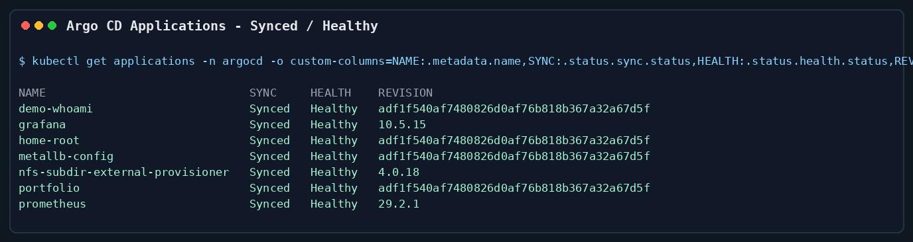

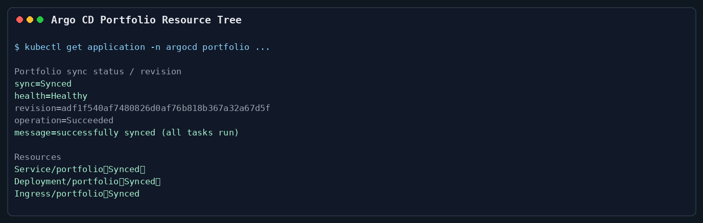

### Cluster Runtime

컨트롤 플레인 3대와 워커 2대로 구성된 5-node Kubernetes 클러스터가 모두
`Ready` 상태입니다.

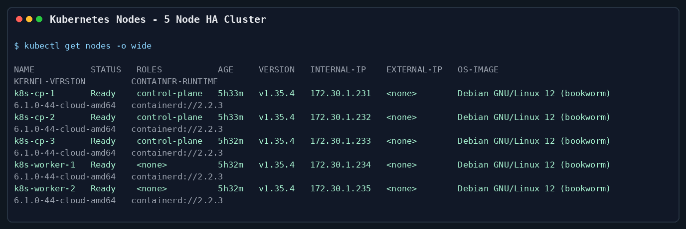

### Ingress And Retired Portfolio Host

`portfolio.mintcocoa.cc` Ingress는 nginx class를 사용하고, MetalLB가 할당한
`172.30.1.240` LoadBalancer IP를 통해 서비스로 연결되도록 검증했습니다.
현재 이 호스트는 상세 문서가 아니라 사용 종료 안내 페이지를 내보내는 경로입니다.

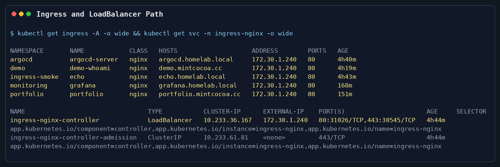

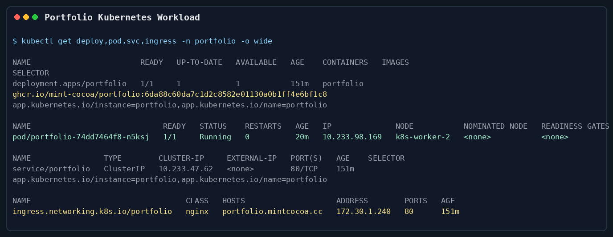

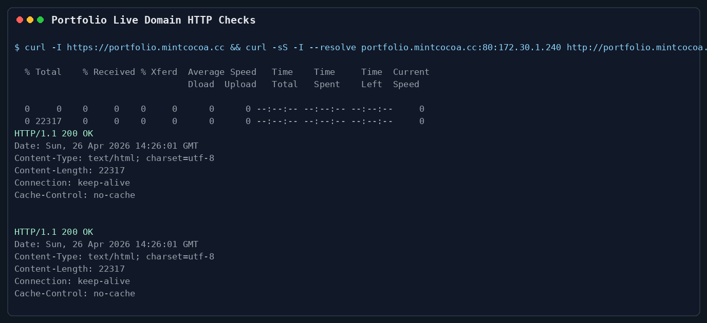

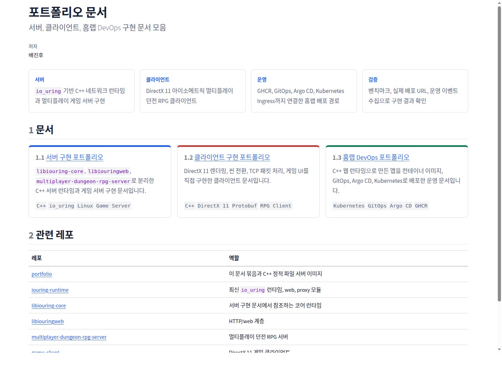

### CI To GitOps Rollout

GitHub Actions의 `portfolio image` workflow가 commit SHA
`6da88c60da7c1d2c8582e01130a0b1ff4e6bf1c8` 이미지를 GHCR에 push했고, GitOps
repo의 `apps/portfolio/values.yaml` image tag를 같은 SHA로 갱신했습니다.
Argo CD portfolio revision `adf1f540af7480826d0af76b818b367a32a67d5f`는 이
GitOps 변경 commit입니다.

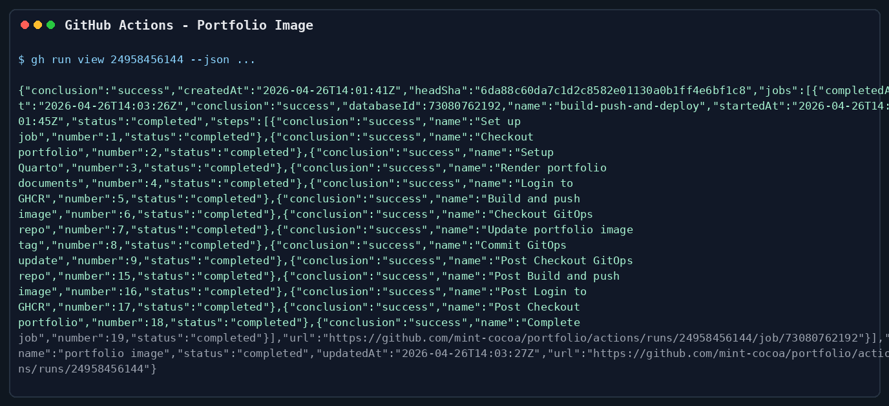

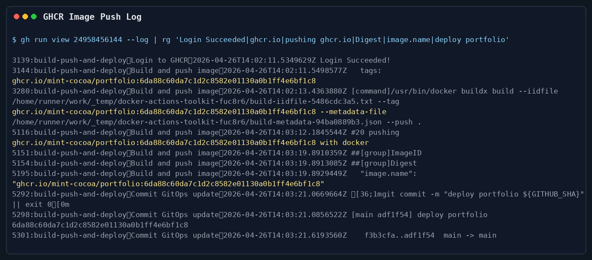

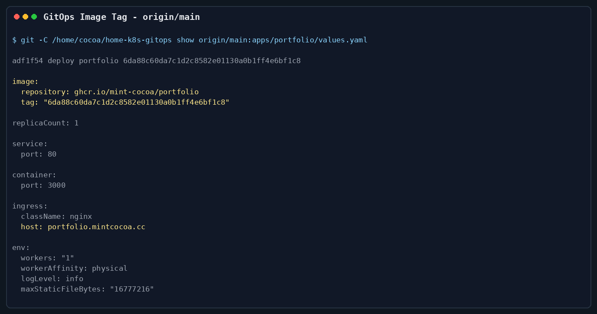

### Storage And Observability

Prometheus와 Grafana는 `monitoring` namespace에서 실행 중이며, 기본
StorageClass는 `nfs-client`입니다. Grafana와 Prometheus PVC가 `Bound` 상태로
유지되어 stateless demo가 아니라 persistent storage까지 연결된 구성을
보여줍니다.

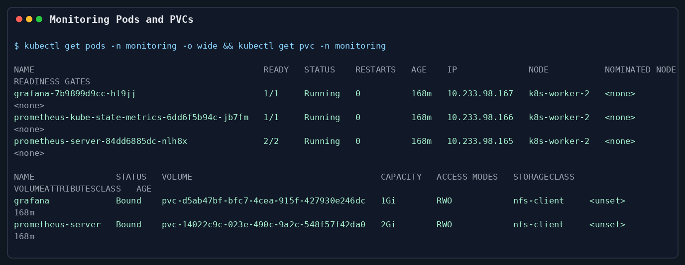

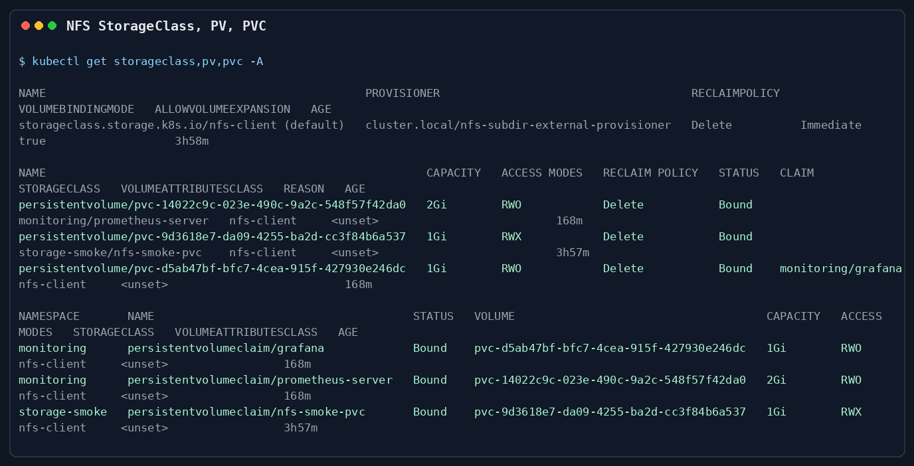

## 결과

이번 작업으로 다음을 달성했습니다.

- 직접 만든 C++ io_uring 웹 런타임으로 portfolio 정적 파일 서버를 운영 경로에 올렸습니다.
- 앱을 GHCR 이미지로 빌드하고 GitOps repo를 자동 갱신하는 경로를 구성했습니다.
- Argo CD automated sync로 홈 Kubernetes 클러스터에 배포했습니다.
- Proxmox VM 기반 5-node Kubernetes HA cluster에서 workload를 운영했습니다.
- MetalLB, ingress-nginx, edge proxy를 통해 `portfolio.mintcocoa.cc` HTTPS 경로를 검증했고, 현재는 해당 경로를 사용 종료 안내로 분리했습니다.
- Prometheus, Grafana, NFS dynamic provisioner로 관측과 persistent storage 기반을 갖췄습니다.

## Current Gaps

현재 남은 운영 gap은 다음과 같습니다.

1. Edge proxy routing을 정리해 `demo.mintcocoa.cc`, `grafana.homelab.local`,
   `argocd.homelab.local`도 `172.30.1.240`의 ingress backend로 라우팅해야 합니다.
2. `k8s-status`와 `dropapp`은 각각 Gatus, PairDrop 기반으로 GitOps 정의를 추가하고
   live cluster에서 검증해야 합니다.
3. Terraform state는 S3 backend scaffold를 추가했지만, 실제 bucket versioning,
   backend credential, `terraform init -backend-config=backend.home.hcl` 검증은
   별도 작업으로 남아 있습니다.
4. Kubespray source는 `ansible/kubespray.lock`으로 `v2.30.0` tag에 pin 했지만,
   실제 cluster upgrade 전에는 release note와 live Kubernetes version을 다시 대조해야
   합니다.
5. Application secret은 SOPS/age 템플릿을 추가했지만, 실제 age recipient 등록,
   encrypted secret commit, Argo CD decryption integration은 아직 수행해야 합니다.
6. NFS/PV 백업은 restic CronJob manifest를 추가했지만, encrypted restic secret 생성,
   첫 backup job 실행, restore smoke test가 필요합니다.
7. Edge proxy virtual host 정리 후 public DNS와 home router forwarding을 외부
   네트워크에서 재검증해야 합니다.

## 회고

가장 큰 성과는 런타임, 컨테이너, GitOps, Kubernetes HA cluster, ingress, edge
proxy가 하나의 end-to-end 시스템으로 연결됐다는 점입니다. C++ 서버 구현만으로
끝내지 않고, 실제 운영에 필요한 배포 자동화, 관측 가능성, persistent storage까지
연결하면서 런타임의 실사용성을 검증했습니다.

다음 단계는 edge proxy virtual host mapping을 정리하고, Gatus 기반 `k8s-status`와
PairDrop 기반 `dropapp`을 Argo CD Application으로 활성화해 live workload로 검증하는 것입니다.

## 관련 레포

::: {.repo-links}
| 레포 | 역할 |
|---|---|
| [iouring-runtime](https://github.com/mint-cocoa/iouring-runtime) | C++ runtime, web module, proxy module |
| [portfolio](https://github.com/mint-cocoa/portfolio) | 이 문서와 C++ 정적 파일 서버 이미지 |
| [home-k8s-gitops](https://github.com/mint-cocoa/home-k8s-gitops) | Helm values, Argo CD Application, cluster desired state |
:::

## 다음 문서

::: {.next-docs}
[포트폴리오 문서 인덱스](../index.html) ·
[서버 구현 포트폴리오](../server/ServerCorePortfolio.html) ·
[클라이언트 구현 포트폴리오](../client/ClientPortfolio.html)
:::
