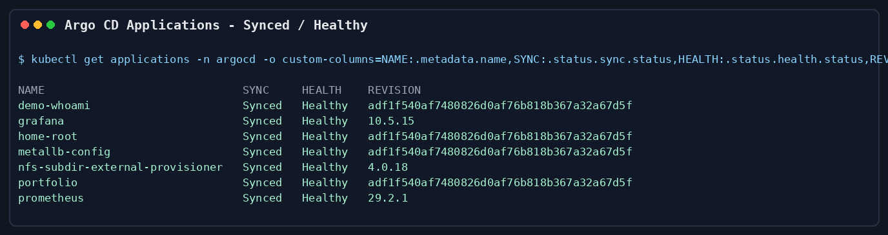
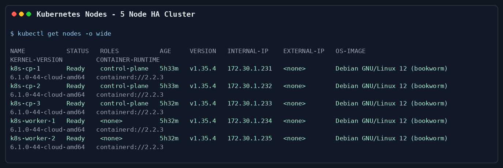
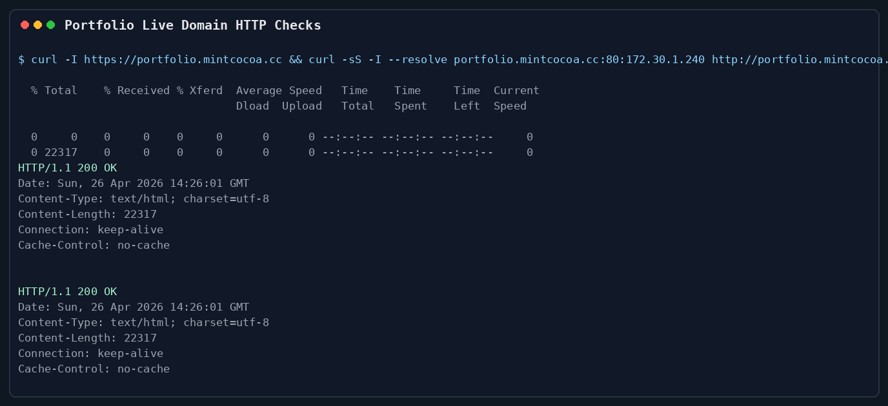
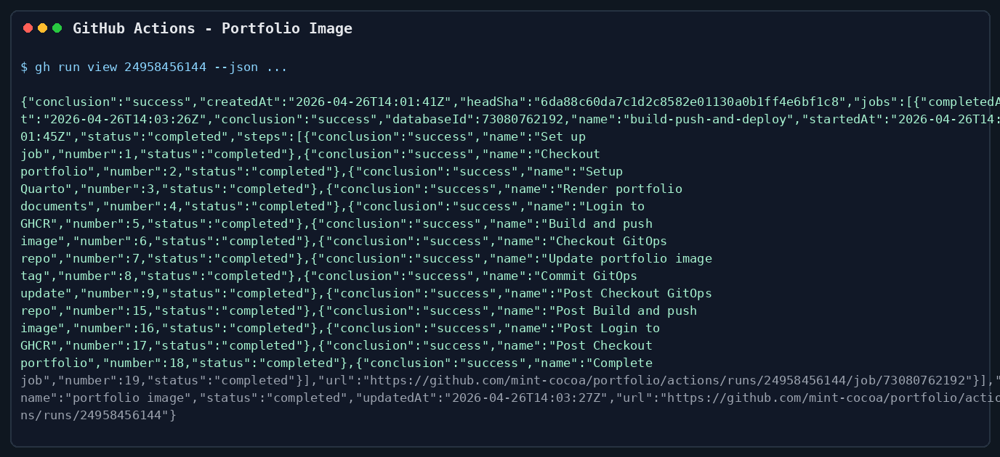
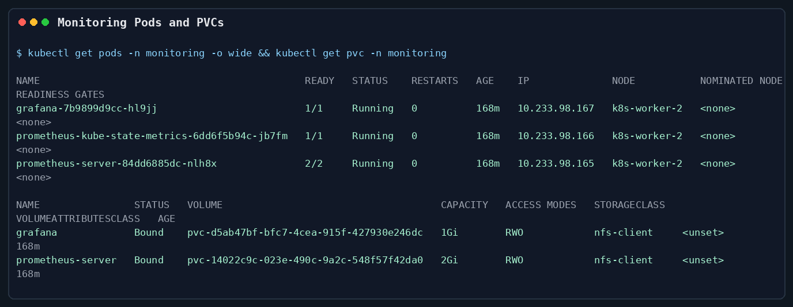

## 핵심 요약

::: {.summary-grid}
::: {.summary-card}
**Infra**

NAS, Mini PC, Proxmox VM을 묶어 Kubernetes 기반 홈랩 운영 환경 구성
:::

::: {.summary-card}
**Delivery**

GitHub Actions, GHCR, GitOps, Argo CD로 commit 기반 배포 흐름 구성
:::

::: {.summary-card}
**C++ Edge**

직접 만든 C++ 서버 엔진 위에 정적 파일 서버와 reverse proxy 경로 구현
:::

::: {.summary-card}
**Operate**

개인 도메인, Ingress, Prometheus/Grafana, NFS storage까지 연결
:::
:::

## 개요

이 문서는 직접 만든 C++ `io_uring` 서버 엔진 기반 서비스를 실제 홈랩 환경에
배포하고 운영한 과정을 정리한 문서입니다. 단순히 서버를 구현하는 데서 끝내지 않고,
컨테이너 이미지 빌드, GitOps 배포, Kubernetes Ingress, persistent storage,
관측성까지 이어지는 운영 흐름을 구성했습니다.

현재 공개 포트폴리오의 기준 경로는 GitHub Pages이고,
`portfolio.mintcocoa.cc`는 같은 산출물을 홈랩 Kubernetes와 C++ `RuntimeWeb`
컨테이너를 통해 서빙하는 미러 경로입니다.

| 항목 | 구성 |
|---|---|
| 애플리케이션 이미지 | GHCR |
| 배포 제어 | GitHub Actions + GitOps + Argo CD |
| 실행 환경 | Proxmox VM 기반 Kubernetes cluster |
| 외부 노출 | ingress-nginx + MetalLB + 개인 도메인 |
| 저장소 | NAS/NFS 기반 dynamic provisioning |
| 관측성 | Prometheus + Grafana lightweight profile |

## 전체 구조

```{mermaid}
flowchart LR
    Dev[Developer PC] --> GitHub[GitHub push]
    GitHub --> Actions[GitHub Actions]
    Actions --> GHCR[GHCR image]
    Actions --> GitOps[GitOps values update]
    GitOps --> Argo[Argo CD sync]
    Argo --> K8s[Kubernetes workload]
    K8s --> Ingress[ingress-nginx + MetalLB]
    Ingress --> Domain[portfolio.mintcocoa.cc]
```

운영 흐름은 애플리케이션 코드와 운영 매니페스트를 분리했습니다. 앱 저장소에서
이미지를 만들고, GitOps 저장소의 image tag만 갱신하면 Argo CD가 클러스터 상태를
맞추는 구조입니다. 실행 중인 이미지 tag가 Git commit SHA와 연결되므로 문제가
생겼을 때 어떤 코드가 배포되어 있는지 추적할 수 있습니다.

## C++ 서버 엔진과 연결한 부분

`iouring-runtime`의 `RuntimeWeb` 모듈을 사용해 포트폴리오 정적 파일 서버를
구성했습니다. 이 서버는 `/healthz` 같은 운영용 endpoint와 정적 파일 서빙을 담당하고,
컨테이너 이미지로 빌드되어 Kubernetes workload로 배포됩니다.

또한 reverse proxy 경로를 별도로 구현해 개인 도메인으로 들어온 트래픽을
Kubernetes Ingress, local service, RuntimeWeb service로 분기하는 구조를 검증했습니다.
즉, C++ 서버 엔진이 단순 예제 코드가 아니라 홈랩 서비스의 edge/runtime 구성 요소로
사용될 수 있는지 확인한 작업입니다.

## 배포 흐름

1. `portfolio` 또는 `iouring-runtime` 저장소에 변경을 push합니다.
2. GitHub Actions가 문서를 렌더링하고 컨테이너 이미지를 빌드합니다.
3. 이미지는 `ghcr.io/mint-cocoa/<app>:<GITHUB_SHA>` 형식으로 push됩니다.
4. GitOps 저장소의 Helm values image tag를 같은 SHA로 갱신합니다.
5. Argo CD가 변경을 감지해 Kubernetes workload를 동기화합니다.

이 구조 덕분에 수동으로 서버에 접속해 파일을 덮어쓰지 않고, Git commit을 기준으로
배포와 롤백 경로를 관리할 수 있습니다.

## 운영 구성

| 영역 | 역할 |
|---|---|
| Management | Terraform, Kubespray, kubectl, Helm, GitOps bootstrap |
| Workload | Kubernetes 위에서 portfolio, monitoring 등 workload 실행 |
| Delivery | GitHub Actions, GHCR, Argo CD가 이미지와 배포 상태 관리 |
| Storage | NAS/NFS 기반 PVC 제공 |
| Observability | Prometheus와 Grafana로 cluster/workload 상태 확인 |

스토리지는 NFS provisioner를 통해 PVC 요청 시 PV가 자동 생성되도록 구성했습니다.
관측성은 홈랩 규모에 맞춰 Prometheus와 Grafana를 가볍게 분리 구성했고,
운영 대시보드는 별도 read-only Ops API를 통해 Prometheus와 Proxmox 상태를 읽습니다.

대시보드: [Live Ops Dashboard](OpsDashboard.html)

## 검증한 내용

::: {.evidence-block}
| 검증 항목 | 확인한 내용 |
|---|---|
| GitOps 배포 | GitHub Actions가 image push 후 GitOps image tag를 갱신 |
| Argo CD 동기화 | Application이 `Synced` / `Healthy` 상태로 수렴 |
| Ingress 노출 | `portfolio.mintcocoa.cc`에서 홈랩 미러 경로 응답 |
| Storage | NFS 기반 PVC/PV가 `Bound` 상태로 유지 |
| 관측성 | Prometheus/Grafana workload와 Ops Dashboard 동작 |
:::

아래 캡처는 실제 홈랩 클러스터와 배포 파이프라인에서 수집한 운영 증거입니다.
민감한 token, secret, credential 원문은 포함하지 않았습니다.











## 결과

- C++ 서버 엔진 기반 포트폴리오 서버를 컨테이너 이미지로 빌드하고 Kubernetes에 배포했습니다.
- GitHub Actions, GHCR, GitOps, Argo CD를 연결해 commit 기반 자동 배포 흐름을 구성했습니다.
- 개인 도메인과 Ingress를 통해 홈랩 미러 경로를 외부에서 접근 가능하게 만들었습니다.
- Prometheus/Grafana, NFS storage, Ops Dashboard를 붙여 운영 상태를 확인할 수 있게 했습니다.
- 서버 구현, 배포 자동화, 운영 관측을 하나의 end-to-end 흐름으로 연결했습니다.

## 남은 작업

- reverse proxy virtual host mapping을 더 정리해 여러 공개 hostname을 안정적으로 분기
- `k8s-status`, `dropapp` 같은 추가 공개 workload를 GitOps Application으로 활성화
- Terraform state backend, SOPS/age secret, restic backup/restore smoke test 보강

## 관련 레포

::: {.repo-links}
| 레포 | 역할 |
|---|---|
| [iouring-runtime](https://github.com/mint-cocoa/iouring-runtime) | C++ server engine, RuntimeWeb, RuntimeProxy, RuntimeGame |
| [portfolio](https://github.com/mint-cocoa/portfolio) | 이 문서와 C++ 정적 파일 서버 이미지 |
| [home-k8s-gitops](https://github.com/mint-cocoa/home-k8s-gitops) | Helm values, Argo CD Application, cluster desired state |
:::

## 다음 문서

::: {.next-docs}
[포트폴리오 문서 인덱스](../index.html) ·
[서버 구현 포트폴리오](../server/ServerCorePortfolio.html) ·
[클라이언트 구현 포트폴리오](../client/ClientPortfolio.html)
:::
