## 프로토콜 독립 전송 런타임

게임 서버에서 시작한 네트워크 구현을 HTTP 서버, TCP/TLS 프록시, 패킷 게임 서버가 공유할 수 있는 Core 런타임으로 분리한 문서입니다. 핵심은 특정 프로토콜 기능이 아니라 완료 통지 기반 I/O에서 세션 수명, 버퍼, 송신 순서, 백프레셔, 워커 간 직렬화 경계를 고정한 과정입니다.

이 문서는 다음 네 가지 관점으로 구현을 돌아봅니다.

- CQE가 늦게 돌아오는 상황에서도 세션과 이벤트 생존 범위를 보장하는 방법
- 세션당 하나의 활성 송신 작업으로 부분 송신과 메시지 순서 뒤섞임을 막는 방법
- 느린 소비자 앞에서 생산 위치를 늦추고 보류 queue를 제한하는 방법
- HTTP, Proxy, Game 의미를 Core 밖 모듈에서 해석하도록 경계를 유지하는 방법

## 문서 구성

::: {.chapter-map}
::: {.chapter-card}
<a href="#runtime-설계와-실행-모델" class="chapter-number">01</a>

<p class="chapter-title">Runtime 설계와 실행 모델</p>

io_uring 기반 Core가 소켓, CQE, Session을 어떻게 하나의 실행 모델로 묶는지 정리합니다.
:::

::: {.chapter-card}
<a href="#수명-관리" class="chapter-number">02</a>

<p class="chapter-title">수명 관리</p>

SessionManager, IoEvent, pending_io_, SessionState가 각각 어느 생존 범위를 판단하는지 분리합니다.
:::

::: {.chapter-card}
<a href="#버퍼-관리" class="chapter-number">03</a>

<p class="chapter-title">버퍼 관리</p>

수신 fast/slow path와 송신 순서 보장, 부분 송신 복구를 설명합니다.
:::

::: {.chapter-card}
<a href="#room과-session-직렬화" class="chapter-number">04</a>

<p class="chapter-title">Room과 Session 직렬화</p>

Room 상태 순서, WorkerOutbox, Session owner ring이 서로 다른 순서를 보장하는 이유를 다룹니다.
:::

::: {.chapter-card}
<a href="#생산-소비-백프레셔" class="chapter-number">05</a>

<p class="chapter-title">생산/소비 백프레셔</p>

SendQueue, Proxy, Paused recv, HTTP streaming에서 느린 소비자 앞의 생산 위치를 조절합니다.
:::

::: {.chapter-card}
<a href="#선택-모듈-검증-최종-정리" class="chapter-number">06</a>

<p class="chapter-title">선택 모듈, 검증, 최종 정리</p>

Web/Proxy/Game 모듈과 검증 결과를 통해 Core 불변식이 유지되는지 확인합니다.
:::
:::

::: {.repo-links}
| 항목 | 링크 |
| --- | --- |
| 구현 저장소 | [iouring-runtime](https://github.com/mint-cocoa/iouring-runtime) |
| 공개 문서 기준 URL | [mint-cocoa.github.io/portfolio/](https://mint-cocoa.github.io/portfolio/) |
| 기존 세부 서버 문서 | [ServerCorePortfolio.html](server/ServerCorePortfolio.html) |
:::


## Runtime 설계와 실행 모델

### 전체 구조
`ServerCore`는 Linux `io_uring`을 기반으로 구현한 비동기 서버 런타임입니다.

처음에는 게임 서버를 만들기 위한 기반 코드로 시작했지만, 구현을 진행하면서 TCP 연결 수락, 수신/송신, 시간 초과와 취소, 버퍼 소유권, 세션 수명주기, 스레드 간 작업 전달과 같은 요소들이 특정 게임 로직에만 종속되는 기능이 아니라는 점을 알게 되었습니다. 

이들은 여러 서버 애플리케이션에서 공통적으로 필요한 실행 기반에 가깝다고 판단했고, 해당 기능들을 게임 서버 코드에 직접 묶어두지 않고 여러 프로토콜과 서비스가 공유할 수 있는 Core 런타임으로 분리했습니다.

Core의 역할은 바이트 스트림을 수신하고 송신하며, 비동기 I/O 완료 통지를 처리하는 것입니다. 다만 수신된 바이트가 HTTP 요청인지, 프록시 스트림인지, 게임 패킷인지는 Core가 해석하지 않고, HTTP, Proxy, Game은 Core 위에 올라가는 선택 모듈로 분리되며 각 모듈은 자신에게 필요한 파서, 라우팅, 패킷 프레이밍, Room 실행 모델과 같은 기능만 추가합니다.

구현된 런타임은 `io_uring` 기반 TCP 비동기 I/O 처리와 그 수명주기를 관리합니다. 각 소켓은 `Session` 단위로 감싸지며, 연결 수락, 수신/송신, 버퍼 관리, 시간 초과, 취소, 동시성 제어, 세션 수명주기 처리는 Core에서 담당합니다.

프로토콜 해석과 애플리케이션 정책은 상위 모듈로 분리됩니다. 예를 들어 Web 요청은 Core의 `Session`을 통해 수신된 뒤 `HttpSession::OnRecv()`로 전달되고, HTTP 파싱, 라우팅, 핸들러 실행은 Web 모듈에서 처리됩니다. 응답 데이터는 다시 Core의 `Session::Send()`를 통해 송신 경로로 내려갑니다.

`HttpSession`과 `PacketSession`은 모두 Core의 `Session`을 기반으로 동작하지만, 수신된 TCP 바이트 스트림을 메시지 단위로 해석하는 방식이 다릅니다. `PacketSession`은 `[size][id][payload]` 형식의 고정 헤더를 기준으로 패킷 경계를 판단하고, `HttpSession`은 HTTP 파서 상태를 유지하며 헤더 종료, `Content-Length`, chunked 본문, 파이프라이닝 여부를 해석합니다.

Core는 연결 수명주기와 비동기 I/O 처리, 버퍼 및 완료 이벤트 관리를 공통으로 담당하고, 스트림을 어떤 메시지 모델로 변환할지는 각 프로토콜 세션이 담당합니다. 이를 통해 게임 서버뿐 아니라 HTTP 서버, 프록시 서버, 패킷 기반 서비스 등 다양한 서버 모듈이 동일한 Core 런타임 위에서 동작할 수 있도록 설계했습니다.

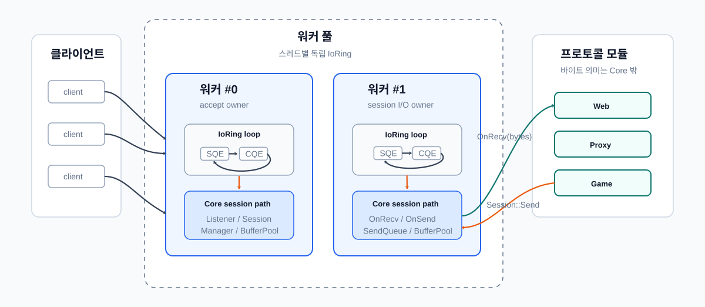

### 주요 클래스
|Core|설명|
|---|---|
|`Listener`|소켓 bind/listen, 다중 완료 연결 수락, 연결 분산|
|`Session`|fd 상태, 수신/송신 흐름, 닫힘 상태 전환|
|`IoRing`|SQE 제출, CQE 비우기, `user_data` 기반 이벤트 복원|
|`RingBuffer`|제공 버퍼 관리, 뷰 생성, 반환 정책|
|`SendQueue`|대기 중인 송신 관리, 부분 송신 재시도, watermark|
|`Timeout / Cancel`|비활성 시간, deadline, 취소 요청|
|`Owner Ring`|세션 I/O 상태 직렬화|

### 실행 루프
실행 흐름의 중심은 `IoRing`입니다. `IoRing`은 사용자 객체를 `IoEvent`로 감싼 뒤 SQE에 연결해 커널에 제출하고, CQE가 도착하면 `user_data`에서 다시 `IoEvent`를 복원합니다. 복원된 이벤트는 해당 `Session` 또는 `Listener`로 dispatch됩니다.

이때 `IoRing`은 완료 통지를 사용자 객체로 되돌리는 실행 장치이고, `Session`은 그 완료가 연결 상태, 수신/송신 큐, 버퍼 반환, 종료 절차에 어떤 의미를 갖는지 판단하는 소유 객체입니다.

실행 루프는 다음 다섯 구간으로 나눌 수 있습니다.

| 구간          | 책임                                       | 의미                      |
| ----------- | ---------------------------------------- | ----------------------- |
| submit      | `IoEvent`를 SQE에 연결하고 커널에 제출              | 사용자 객체와 커널 작업을 묶는 지점    |
| kernel      | `io_uring`이 비동기 작업을 수행하고 CQE 생성          | 사용자 코드 밖에서 I/O가 진행되는 구간 |
| cqe restore | `IoRing`이 CQE를 꺼내 `user_data`에서 이벤트 복원   | 커널 완료가 런타임 객체로 돌아오는 경계  |
| dispatch    | 복원된 이벤트를 `Session` 또는 `Listener` 콜백으로 전달 | 완료 통지를 소유 객체에 넘기는 경계    |
| disposition | 콜백 결과로 이벤트 처분 결정                         | 완료, 유지, 재제출 중 무엇을 할지 판단 |

세션 콜백은 이번 CQE로 이벤트가 끝났는지, 같은 multishot 제출이 계속 살아 있는지, 또는 같은 이벤트 객체로 새 SQE를 재제출했는지를 반환합니다. 이 결과에 따라 `IoRing`은 이벤트를 정리하거나 유지하거나 다시 제출 상태로 둡니다.


전체 흐름은 다음과 같습니다.

```text
상위 모듈
  -> Session::Send() / OnRecv()
  -> Core Session 상태 변경
  -> IoEvent 생성
  -> IoRing submit
  -> kernel io_uring 처리
  -> CQE 도착
  -> IoRing user_data 복원
  -> Session / Listener dispatch
  -> DispatchResult에 따라 완료, 유지, 재제출
```

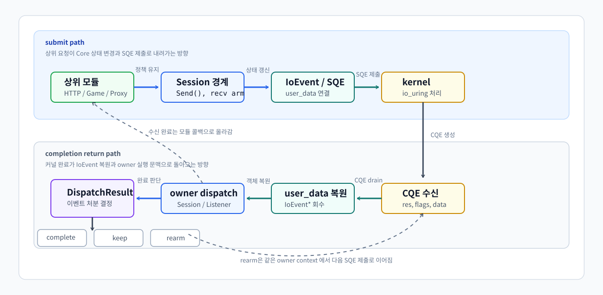

이 구조 덕분에 Core는 프로토콜을 해석하지 않으면서도, 비동기 I/O 완료, 버퍼 수명, 세션 종료, 재제출 여부를 일관된 실행 모델 안에서 처리할 수 있습니다.

***

## 수명 관리

클라이언트와 서버 간의 연결을 `Session`으로 관리하려고 하니 세션의 생존과 해제 조건이 명확하지 않다는 문제가 생겼습니다. 세션이 살아 있다는 말이 "세션이 연결 목록에 남아 있다"는 뜻인지, "이미 제출된 I/O의 CQE가 아직 돌아올 수 있다"는 뜻인지, "CQE 콜백을 실행하는 동안 콜백 대상이 파괴되지 않아야 한다"는 뜻인지가 서로 다르기 때문입니다.
그래서 세션 수명 관리 장치를 하나의 소유권 이야기로 합치는 것이 아니라, 각 장치가 보장하는 방식으로 수명 관리를 설계했습니다.

### 제출된 I/O와 콜백 대상 생존
`SessionManager`는 외부에서 세션을 “현재 연결된 세션”으로 취급하는 동안의 소유자입니다. 하지만 이것만으로는 이미 `io_uring`에 제출된 I/O의 CQE 콜백 대상 생존을 보장할 수 없습니다.

`io_uring`의 SQE `user_data`에는 제출된 I/O 하나를 대표하는 `IoEvent*`가 들어갑니다. CQE가 도착하면 `IoRing`은 그 포인터를 복원하고, 이벤트 객체의 `Complete()`를 호출합니다.

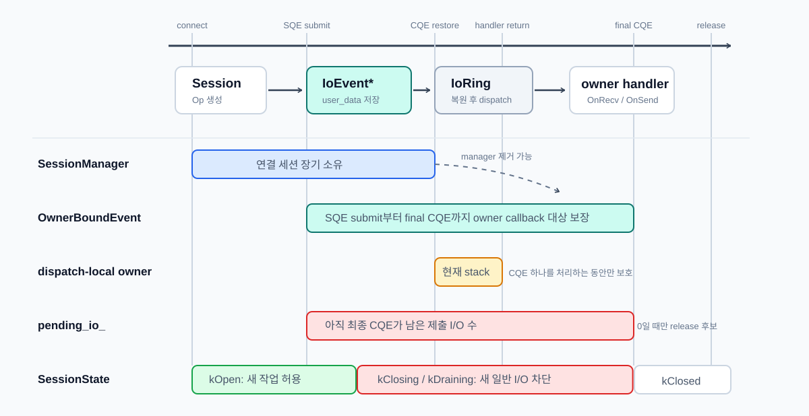

```cpp
auto* ev = reinterpret_cast<IoEvent*>(data);
const auto dispatch_result = ev->Complete(result, flags);
```

`IoRing`은 이 이벤트가 `Session` 작업인지, `Listener` 작업인지 알 필요가 없습니다. `IoEvent::Complete()` 안에서 operation 타입별 `Dispatch()`가 실행되고, `RecvOp`, `SendOp`, `DisconnectOp`, `AcceptOp` 같은 제출 이벤트가 자기 owner의 handler로 완료를 넘깁니다.

따라서 콜백 대상 생존은 `SessionManager`가 아니라 제출된 operation 객체가 보장합니다. `SessionManager`는 “현재 연결 목록”을 관리하고, 제출 이벤트는 “이미 커널에 제출된 I/O가 완료될 때까지 콜백 대상을 살려두는 책임”을 가집니다.


### `DispatchResult`와 `pending_io_`
CQE를 처리한 뒤에는 두 가지를 따로 판단해야 합니다.

1. 이번 CQE를 받은 `IoEvent` 객체를 끝내도 되는지
2. 세션 전체에서 아직 돌아오지 않은 제출 I/O가 남아 있는지

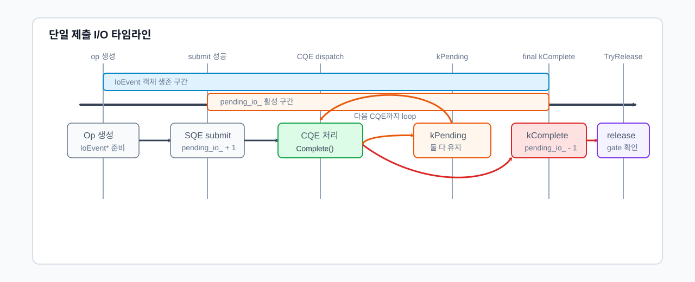

multishot 수신에서는 하나의 SQE가 여러 CQE를 만들 수 있습니다. 중간 CQE는 데이터를 하나 전달하지만, 같은 수신 제출은 계속 살아 있을 수 있습니다. 따라서 CQE 하나를 받았다고 해서 항상 제출 I/O 하나가 끝났다고 볼 수 없습니다.

이를 분리하기 위해 이벤트 콜백은 `DispatchResult`를 반환하고, 세션은 제출 I/O 단위로 `pending_io_`를 관리합니다.

| 경로 | CQE 의미 | `DispatchResult` | `pending_io_` 처리 |
| --- | --- | --- | --- |
| 단일 송신 완료 | 제출한 send 하나가 끝남 | `kComplete` | 감소 |
| 짧은 쓰기 | 같은 `SendOp`를 남은 바이트로 재제출 | `kPending` | 재제출 성공 시 유지 |
| multishot 수신 중간 CQE | 같은 수신 제출이 계속 살아 있음 | `kPending` | 유지 |
| multishot 수신 최종 CQE | multishot 제출이 종료됨 | `kComplete` | 감소 |
| cancel/shutdown 완료 | 종료용 제출이 완료됨 | `kComplete` | 감소 |

`kPending`은 이벤트 객체가 아직 끝나지 않았다는 뜻입니다. multishot receive에서 `IORING_CQE_F_MORE`가 붙은 CQE가 대표적입니다. 같은 수신 SQE에서 CQE가 더 올 수 있으므로 이벤트 객체를 유지하고, `pending_io_`도 감소시키지 않습니다.

부분 send도 같은 이유로 `kPending`이 될 수 있습니다. CQE를 받은 뒤 같은 `SendOp`를 남은 바이트 범위의 새 send SQE에 다시 연결해야 하므로 이벤트 객체를 삭제하지 않습니다. 재제출이 성공하면 기존 제출 흐름을 유지하고, 재제출이 실패한 경우에만 `CompletePendingIo()`로 기존 제출분을 정리합니다.

`kComplete`는 이번 CQE 처리 뒤 이벤트 객체를 완료 처리할 수 있다는 뜻입니다. 단일 send 완료, cancel 완료, shutdown 완료, 또는 `IORING_CQE_F_MORE`가 없는 multishot 최종 CQE가 여기에 해당합니다.


### 종료 상태와 해제 조건
`pending_io_`는 이미 제출된 I/O가 남았는지만 셉니다. 하지만 종료가 시작된 세션이 새 수신, 송신, 등록 작업을 받아도 되는지는 별도의 상태 판단입니다.

| `SessionState` | 의미 |
| --- | --- |
| `kOpen` | 정상 송수신 가능 |
| `kClosing` | 종료 시작, 새 일반 작업 차단 |
| `kDraining` | 종료 관련 제출 이후 남은 CQE를 비우는 중 |
| `kClosed` | 연결 종료 통지와 manager 해제 완료 |

종료 흐름은 “새 작업 차단 → 종료 관련 작업 제출 → 남은 CQE 비우기 → 한 번만 해제” 순서로 진행됩니다.

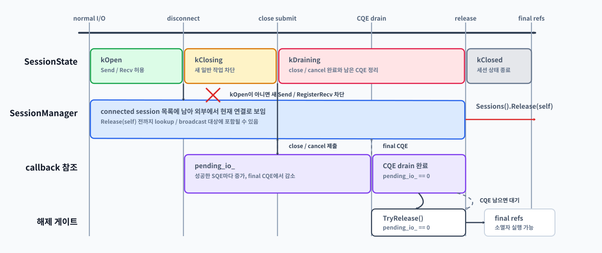

1. `Disconnect()`가 호출되면 `SessionState`를 `kClosing`으로 전환합니다.
2. `kOpen`이 아니면 새 수신, 새 송신, 새 등록 작업을 차단합니다.
3. 이미 큐에 들어간 송신 데이터는 정책에 따라 폐기하거나, 종료 전에 drain할지 결정합니다.
4. 취소, `shutdown`, close 관련 정리처럼 커널 제출이 필요한 종료 작업을 등록합니다.
5. 제출에 성공한 종료 작업은 `pending_io_`에 반영합니다.
6. CQE가 도착할 때마다 이벤트 dispatch가 `DispatchResult`를 반환합니다.
7. 최종 완료 CQE는 `pending_io_`를 감소시킵니다.
8. `ClosingStarted() && pending_io_ == 0 && !disconnected_notified_` 조건을 통과하면 `TryRelease()`가 `OnDisconnected()`와 manager 해제를 한 번만 실행합니다.
9. 해제가 끝나면 상태를 `kClosed`로 전환합니다.

`SessionState`가 없으면 이미 종료가 시작된 세션에 새 작업이 다시 들어갈 수 있습니다. 예를 들어 수신 CQE에서 `res == 0`을 보고 peer close를 감지해 종료를 시작했는데, 다른 경로의 `Send()`나 `RegisterRecv()`가 아직 세션을 정상 상태로 보고 새 SQE를 제출할 수 있습니다.

이 경우 닫히는 세션에 multishot recv가 다시 걸리거나, 이미 닫히는 소켓에 새 송신이 들어가거나, drain 중이던 `pending_io_`가 다시 증가할 수 있습니다. 더 나쁘게는 서로 다른 CQE 경로가 동시에 종료 조건을 만족해 `OnDisconnected()`가 중복 호출될 수도 있습니다.

따라서 `pending_io_`는 “이미 제출한 I/O가 모두 끝났는가?”를 판단하고, `SessionState`는 “지금 새 I/O를 받아도 되는가?”를 판단합니다. 둘 중 하나만으로는 안전한 종료 조건을 만들 수 없습니다.

세션 해제는 다음 조건이 모두 만족될 때만 가능합니다.

```text
1. 세션이 종료를 시작한 상태.
2. 새 일반 작업이 차단되어 있음.
3. 이미 제출된 I/O의 최종 CQE가 모두 돌아왔음.
4. 종료 통지가 아직 실행되지 않았음.
```

이를 코드 관점으로 표현하면 다음과 같습니다.

```cpp
bool Session::CanRelease() const {
    return ClosingStarted()
        && pending_io_ == 0
        && !disconnected_notified_;
}
```

`TryRelease()`는 이 조건을 통과한 경우에만 `OnDisconnected()`와 `SessionManager` 해제를 수행합니다. 또한 `disconnected_notified_`를 통해 동일 세션의 종료 통지가 한 번만 실행되도록 막습니다.

```cpp
void Session::TryRelease() {
    if (!CanRelease()) {
        return;
    }

    disconnected_notified_ = true;
    state_ = SessionState::kClosed;

    OnDisconnected();
    manager_->Remove(session_id_);

    // 세션 소유자 실행 문맥에서 호출되어야 순서가 보장됨
}
```

수명 관리는 하나의 세션 소유자를 관리하는것이 아니라, 각 장치가 보장하는 방식으로 설계되었습니다. `SessionManager`는 외부에 노출되는 연결 목록을 관리하고, `OwnerBoundEvent`는 CQE 콜백 대상의 생존을 보장하며, `DispatchResult`는 이벤트를 완료할지 유지할지 재사용할지 결정합니다. 여기에 `pending_io_`가 최종 CQE 대기 수를 추적하고, `SessionState`가 새 작업 허용 여부와 종료 단계를 막아 줍니다.

결국 세션은 새 작업이 차단되고, 제출된 I/O의 최종 CQE가 모두 돌아오고, 종료 통지가 아직 실행되지 않았을 때만 해제될 수 있습니다. 이 경계가 닫혀야 이후 장에서 다루는 버퍼와 송신 큐도 반환된 세션이나 버퍼를 다시 참조하지 않습니다.

***

## 버퍼 관리

### 수신 버퍼
### 버퍼 복사와 비용
기존 수신 경로에서는 매 수신마다 임시 버퍼의 데이터를 세션별 수신 버퍼로 복사했습니다. 이 방식은 구현은 단순하지만, 대부분의 패킷이 한 번의 수신으로 완성되는 상황에서도 불필요한 복사 비용이 발생합니다.

그렇다고 커널이 채운 수신 버퍼의 뷰만 그대로 전달할 수도 없습니다. TCP는 바이트 스트림이기 때문에 애플리케이션이 정의한 패킷 경계를 보존하지 않습니다. 하나의 패킷이 여러 번의 수신으로 나뉘어 도착할 수 있고, 반대로 여러 패킷이 한 번의 수신에 합쳐져 들어올 수도 있습니다.

따라서 수신 버퍼는 단순히 “이번에 받은 데이터”를 담는 공간이 아니라, 다음 역할을 수행할 수 있어야 합니다.

| 역할         | 의미                             |
| ---------- | ------------------------------ |
| 완전한 프레임 파싱 | 이번 수신 데이터 안에서 완성된 패킷을 바로 해석    |
| 조각난 프레임 보존 | 아직 완성되지 않은 패킷의 앞부분을 다음 수신까지 보관 |
| 소비한 데이터 제거 | 이미 파싱한 앞부분을 버리고 남은 데이터만 유지     |
| 경계 누적      | 다음 패킷 경계가 완성될 때까지 데이터를 이어 붙임   |

### 수신 경로 분리
수신 경로는 빠른 경로와 느린 경로로 분리했습니다.

완전한 프레임이 이번 수신 데이터 안에 모두 들어 있는 경우에는 제공 버퍼의 뷰를 그대로 사용해 파싱합니다. 이때 별도의 세션 수신 버퍼로 복사하지 않습니다. 반대로 프레임이 조각나 있거나, 이전 수신에서 남은 조각과 이어 붙여야 하는 경우에만 프로토콜 `RecvBuffer`에 복사해 누적합니다.

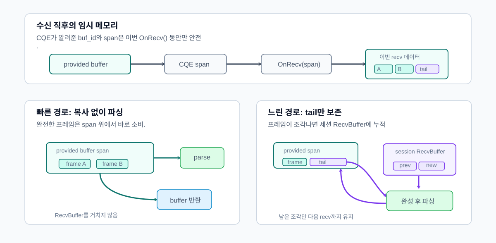

| 상황            | 처리                                 |
| ------------- | ---------------------------------- |
| 완전한 프레임       | provided 버퍼의 `span` 또는 뷰에서 직접 파싱   |
| 여러 완전한 프레임    | provided 버퍼 뷰를 순차적으로 소비하며 반복 파싱    |
| 조각난 프레임       | 세션 소유 `RecvBuffer`에 복사해 다음 수신까지 보존 |
| 이전 조각 + 새 데이터 | `RecvBuffer`에 이어 붙인 뒤 완성 여부 확인     |

이 구조에서 `Session`은 수신 작업의 상태와 제공 버퍼의 반환 타이밍을 관리합니다. 원본 수신 메모리는 `iouring` 가 관리하고, 프로토콜 프레임 재조립은 `RecvBuffer`가 담당합니다.

여러 클라이언트가 동시에 연결되어도 이 경계는 세션별로 독립적입니다. `IoRing`과 provided buffer pool은 공유되지만, 조각난 프레임을 보관하는 `RecvBuffer`, 아직 커널에 제출되지 않은 `SendQueue`, 현재 진행 중인 `SendOp`은 각 `Session` 내부 상태로 분리됩니다.


### 송신 버퍼
### 요청한 길이와 실제 처리된 길이의 불일치
송신 경로에서는 애플리케이션이 넘긴 페이로드의 수명이 송신 완료까지 보장되어야 합니다. 스택 버퍼, 임시 문자열, 임시 `string_view`를 그대로 커널 송신 요청에 넘기면, 커널이 아직 해당 메모리를 참조하고 있는 동안 원본 데이터가 먼저 해제되거나 덮어써질 수 있습니다.

또한 송신 완료 통지는 “요청한 버퍼 전체가 전송되었다”는 뜻이 아닙니다. `sendmsg`나 `io_uring send`는 성공 완료에서도 요청한 바이트 수보다 작은 값을 반환할 수 있습니다. 이 경우 반환된 값은 실제로 처리된 바이트 수이며, 애플리케이션은 그 바이트 수만큼 현재 페이로드의 송신 커서를 전진시켜야 합니다.

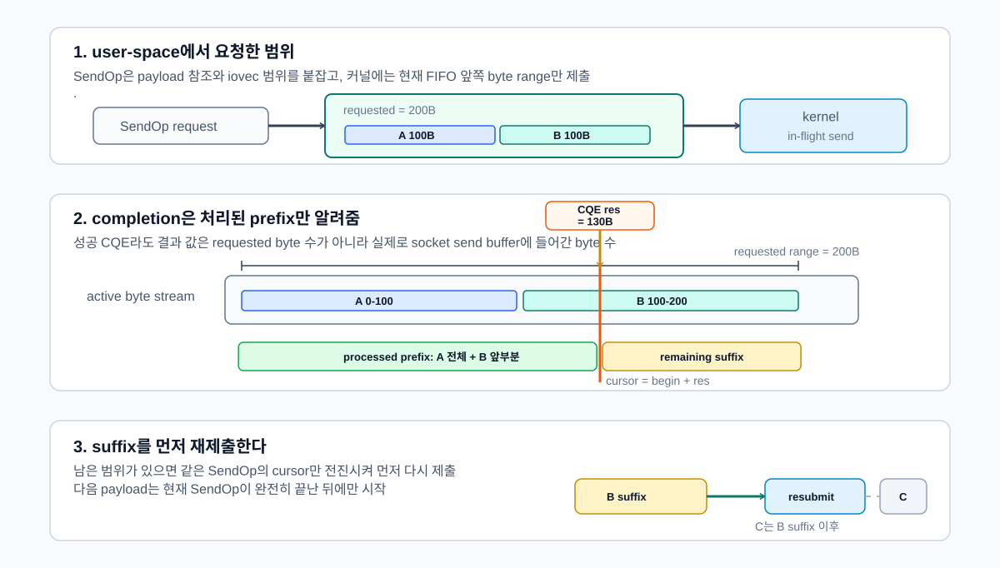

남은 바이트 범위를 기억하지 못하면 두 가지 문제가 생깁니다.

| 문제     | 설명                                                 |
| ------ | -------------------------------------------------- |
| 데이터 누락 | 부분 완료된 뒤 남은 바이트를 다시 보내지 않으면 페이로드 뒷부분이 사라짐          |
| 순서 훼손  | 앞 페이로드가 끝나기 전에 다음 페이로드를 보내면 애플리케이션이 의도한 메시지 순서가 깨짐 |

따라서 송신 버퍼는 페이로드 수명, 송신 커서, 부분 완료 이후의 재제출 순서를 함께 관리해야 합니다.


### 애플리케이션이 의도한 순서 보장 불가
TCP는 네트워크상에서 바이트의 순서를 보존하지만, 애플리케이션이 호출한 `Send(A)`, `Send(B)` 같은 요청 단위나 프로토콜 메시지 경계를 보존하지 않습니다. TCP가 보장하는 것은 소켓 송신 버퍼에 들어간 바이트의 순서이지, 애플리케이션이 의도한 “A 전체가 끝난 뒤 B 전체”라는 의미적 순서가 아닙니다.

따라서 같은 세션 소켓에 대해 둘 이상의 송신 작업을 동시에 커널에 제출하면, 부분 전송이 발생했을 때 애플리케이션이 의도한 순서가 깨질 수 있습니다.

예를 들어 `A`를 먼저 보내고 `B`를 그 다음 보냈더라도, `A` 송신이 일부 바이트만 성공한 상태에서 이미 제출된 `B` 송신이 처리될 수 있습니다. 이 경우 TCP 스트림에는 다음과 같은 순서로 바이트가 들어갈 수 있습니다.

```text
A의 앞부분 + B 전체 + A의 뒷부분
```

TCP는 이 순서를 잘못된 것으로 보지 않습니다. 실제로 소켓 송신 버퍼에 들어간 순서가 그렇기 때문입니다. TCP는 이 바이트열을 다시 `A 전체 + B 전체`로 복구해주지 않으며, 애플리케이션 프로토콜의 메시지 경계도 알지 못합니다.

따라서 애플리케이션이 의도한 송신 순서는 Session의 송신 큐가 직접 보장해야 합니다.

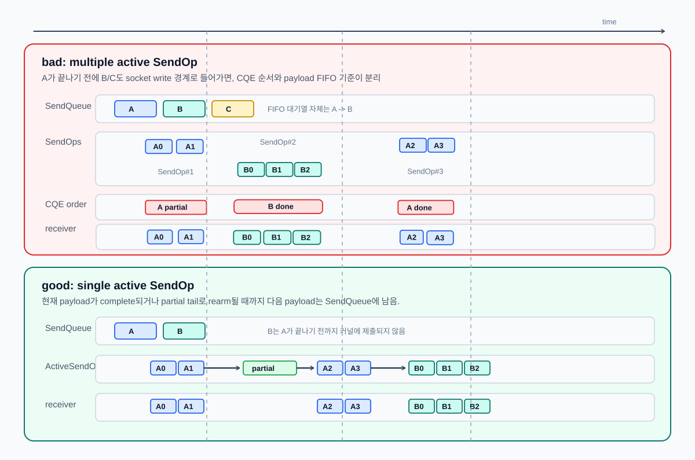

### 세션당 단일 활성 송신 작업
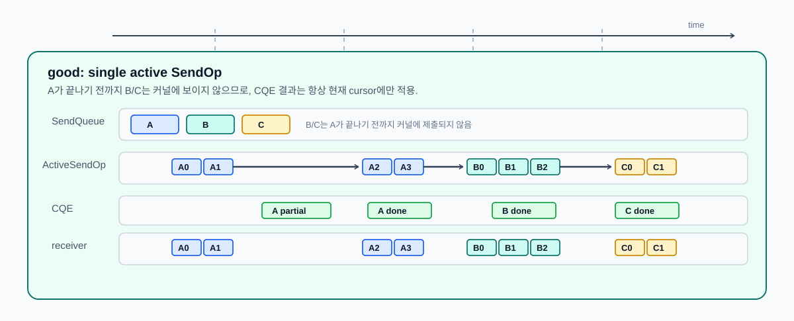

송신 경로는 세션별 큐와 활성 송신 작업 하나로 구성됩니다. 이를 통해 아직 커널에 제출되지 않은 데이터와, 이미 커널에 제출되어 완료를 기다리는 데이터를 분리합니다.

| 구성 요소             | 책임                                              |
| ----------------- | ----------------------------------------------- |
| `SendQueue`       | 아직 커널에 제출되지 않은 `SendBufferRef` 대기열과 등록 필요 여부 관리 |
| `SendOp`          | 진행 중인 `msghdr`, `iovec`, 페이로드 참조, 송신 커서 유지      |
| `active_send_ev_` | 현재 세션에서 커널에 맡긴 단 하나의 활성 송신 작업                   |

소유자 실행 문맥에 들어온 `Send()`는 페이로드를 `send_queue_`에 FIFO로 추가합니다. `SendQueue::Push()`는 첫 추가 주기에서만 `needs_register`를 반환하고, `RegisterSend()`는 이미 `active_send_ev_`가 있으면 즉시 반환합니다. 따라서 현재 송신 작업이 진행 중일 때 새 페이로드가 들어와도, 그 페이로드는 큐에 남아 있을 뿐 커널에는 제출되지 않습니다.

이 구조에서 커널이 알고 있는 현재 세션의 송신 작업은 항상 논리적 FIFO의 맨 앞 조각 하나뿐입니다. 그 앞쪽 조각이 완전히 처리되기 전에는 다음 큐 항목이 커널에 보이지 않습니다.

`sendmsg`의 `iovec`은 하나의 바이트 스트림 앞부분으로 해석되고, CQE의 결과 바이트 수는 그 앞부분에서 몇 바이트가 처리되었는지를 의미합니다. 따라서 짧은 쓰기가 발생하더라도 완료된 바이트 수만큼 현재 `SendOp`의 커서를 전진시키면 남은 뒷부분을 정확히 계산할 수 있습니다.

부분 완료가 발생하면 큐를 재구성하지 않습니다. 현재 `SendOp`의 커서만 전진시키고, 같은 페이로드의 남은 범위를 다시 제출합니다. 현재 `SendOp`이 완전히 끝나기 전까지는 다음 페이로드를 큐에서 꺼내지 않습니다.

즉 송신 경로에서 항상 성립해야 하는 조건은 다음과 같습니다.

1. **세션당 활성 송신 작업은 0개 또는 1개**
   - 같은 세션 소켓에 동시에 둘 이상의 `send`를 제출하지 않음

2. **활성 `SendOp`은 논리적 FIFO의 맨 앞 항목**
   - 뒤의 페이로드가 앞의 페이로드를 추월할 수 없음.

3. **CQE의 성공 결과는 커서 전진으로 처리**
   - 요청한 길이가 아니라 실제 처리된 바이트 수를 기준으로 진행.

4. **현재 `SendOp` 완료 후 다음 항목으로 이동**
   - 부분 전송된 페이로드의 남은 범위를 먼저 처리.

결과적으로 수신과 송신은 모두 “메모리 범위가 언제까지 유효한가”를 기준으로 설계됩니다. 수신은 한 번에 완성된 패킷이면 제공 버퍼 뷰를 바로 해석해 불필요한 복사를 피하고, 조각난 프레임이나 합쳐진 패킷은 `RecvBuffer`가 세션별로 보존합니다. 송신은 커널 완료 전까지 `SendBufferRef`와 `SendOp`이 원본 바이트를 붙잡고, CQE의 실제 처리 바이트 수만큼 커서를 전진시켜 남은 범위를 재제출합니다.

***

## Room과 Session 직렬화

게임 서버에서는 실시간으로 상태가 변하고, 여러 플레이어가 그 상태를 공유합니다. 하지만 각 플레이어의 입력은 서로 다른 네트워크 레이턴시를 거쳐 서버에 도착하므로, 서버는 도착한 입력들을 어떤 순서로 처리할지 결정해야 합니다.

게임 서버에서 `Room`은 같은 공간, 채널, 전투 인스턴스처럼 함께 상태를 공유하는 최소 단위입니다. 플레이어 입장, 퇴장, 이동, 공격, 포탈 이동, 브로드캐스트 대상 결정처럼 “누가 같은 공간에 있고, 어떤 순서로 상태가 바뀌었는지”를 판단해야 하는 작업은 Room의 상태를 기준으로 처리됩니다.

Room은 다음 정보를 하나의 상태 단위로 묶습니다.

|항목|의미|
|---|---|
|멤버 목록|현재 Room에 들어와 있는 플레이어와 세션|
|도메인 상태|위치, 이동, 전투 상태처럼 Room 안에서 공유되는 값|
|입력 작업|입장, 퇴장, 이동, 공격, 포탈 이동처럼 순서가 필요한 요청|
|출력 결정|어떤 플레이어에게 어떤 패킷을 보낼지에 대한 브로드캐스트 결정|

Room이 직접 관리하는 것은 Room 내부 상태입니다. 예를 들면 현재 Room에 들어온 플레이어 목록, Room 안에서 처리할 작업 순서, 그리고 어떤 세션에게 어떤 패킷을 보내야 하는지에 대한 결정, 즉 “게임 상태를 어떤 순서로 바꿀지”를 정해야 합니다.

`Session`은 하나의 클라이언트 연결을 나타냅니다. Session의 책임은 Room 상태를 판단하는 것이 아니라, 해당 연결에 대해 패킷 바이트를 어떤 순서로 쓸지 보장하는 것입니다.

Room이 브로드캐스트 대상을 결정하더라도, 실제 `Send()`가 어느 스레드에서 어떤 순서로 실행될지는 별도의 문제입니다. 같은 Session에는 Room에서 발생한 이동/전투 패킷뿐 아니라 채팅, 인벤토리, 로그인, 시스템 알림처럼 다른 경로의 패킷도 들어올 수 있습니다.

따라서 Room과 Session은 서로 다른 순서를 보장합니다.

|단위|보장하는 순서|
|---|---|
|Room|공유 게임 상태의 변경 순서|
|Session|하나의 TCP 연결에 쓰이는 바이트 순서|

Room은 “게임 상태를 순서대로 바꾸는 곳”이고, Session은 “한 연결에 바이트를 순서대로 쓰는 곳”입니다. Room의 브로드캐스트 결과는 Session 송신 큐에 들어가는 입력일 뿐이며, 실제 커널 송신 제출과 부분 송신 복구는 Session의 책임입니다.


### 직렬화 경계가 필요한 이유
`iouring-runtime`의 게임 서버는 여러 `IoWorker`가 각자의 `io_uring` 루프를 가지고 병렬로 실행됩니다. 이 구조에서는 같은 Room이나 같은 Session에 대한 요청이 서로 다른 스레드에서 동시에 발생할 수 있습니다.

단순하게 모든 상태를 뮤텍스로 보호할 수도 있습니다. 하지만 그렇게 하면 게임 로직, 소켓 I/O, Room 브로드캐스트, Session 송신 경로 전체에 락이 퍼집니다. 락 범위가 넓어질수록 어떤 상태를 누가 소유하는지 불명확해지고, 교착이나 락 순서 문제도 생기기 쉬웠습니다.

여기에서는 전역 락 대신 상태의 소유자를 명확히 나누고, 스레드 간 작업을 해당 상태의 소유자 실행 context로 모으는 방식을 선택했습니다.

| 경계                   | 소유자                 | 통과하는 데이터                                     | 보장하는 것                        |
| -------------------- | ------------------- | -------------------------------------------- | ----------------------------- |
| `Room JobQueue`      | Room을 실행 중인 워커      | join, leave, move, attack, portal, 브로드캐스트 결정 | Room 상태는 한 번에 하나의 job만 변경     |
| `WorkerOutbox`       | 대상 `IoWorker`       | 세션별 Room 출력                                  | 같은 세션으로 가는 Room 출력은 FIFO로 비워짐 |
| `Session owner ring` | 해당 세션의 `IoRing` 스레드 | `Send()`, `send_queue_`, `SendOp`            | 한 연결의 쓰기 상태는 소유자 ring에서만 변경   |

Room의 `JobQueue`는 여러 세션에서 들어온 요청은 큐에 쌓이지만, Room owner는 그 큐를 한 번에 하나씩만 비우며 Room 상태를 변경합니다. Room이 만든 출력은 바로 세션에 쓰지 않고 `WorkerOutbox`라는 출력 메일박스에 세션별로 들어갑니다. 마지막으로 각 세션 owner ring에서 그 큐를 `Session::SendQueue`로 옮기기 때문에, Room 결정 순서가 같은 세션의 송신 큐 삽입 순서로 이어집니다.

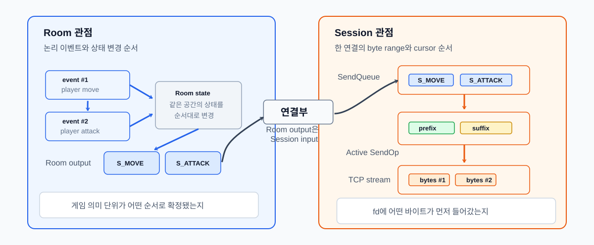

### Room 출력 순서 보장
Room이 만든 패킷을 곧바로 각 Session 소유자 ring 으로 흩어 보내면, 클라이언트가 보는 순서가 Room의 처리 순서와 달라질 수 있습니다.

기존 `RunOnRing()` 방식은 대상 ring이 현재 ring이면 즉시 실행하고, 다른 ring이면 비동기로 전달했습니다. 이 차이 때문에 Room 내부의 논리 순서와 실제 `Session::SendQueue` 삽입 순서가 달라질 수 있습니다.

예를 들어 Room이 같은 세션에 대해 `Packet #1`, `Packet #2`를 순서대로 만들었다고 하더라도, 하나는 현재 ring에서 즉시 `Send()`되고 다른 하나는 다른 ring으로 비동기 전달되면 실제 Session 송신 큐에 들어가는 순서가 Room의 출력 순서와 달라질 수 있습니다.

Room은 순서대로 처리했지만, 출력 경로가 즉시 실행 경로와 비동기 실행 경로로 갈라지면서 실제 송신 큐 삽입 순서가 뒤집힐 수 있었습니다.

이를 해결하기 위해 Room에서 나온 출력은 세션에 바로 `Send()`하지 않고, 대상 쓰레드의 발신 메일박스인 `WorkerOutbox`에 먼저 넣습니다.

`Room::SendTo()`, `BroadcastAll()`, `BroadcastExcept()`는 모두 `worker->EnqueueOutbound(...)`를 호출합니다.

`WorkerOutbox`는 세션 id별 큐를 가지고, `IoWorker::Run()`의 drain 단계에서 소유 스레드가 직접 비웁니다. 즉시 `Send()`하지 않고 반드시 outbox를 거치기 때문에, 같은 세션으로 가는 Room 출력은 하나의 FIFO 경로를 통과합니다.

서로 다른 세션으로 가는 메시지는 각 세션 큐에서 독립적으로 처리됩니다. 여기서 보장하는 것은 Room이 만든 출력이 같은 대상 Session으로 전달될 때, 그 Room 출력의 상대 순서가 유지된다는 것입니다.

각 Session은 자신을 소유한 `IoWorker` 스레드가 정해져 있습니다. 예를 들어 1번 세션은 1번 스레드, 2번 세션은 2번 스레드, 3번 세션은 3번 스레드가 소유합니다. Room은 여러 Session에서 들어온 입력을 하나의 Room 입력 큐로 모아 처리하지만, Room이 만든 출력은 다시 각 Session을 소유한 스레드의 `outbox[session]`으로 돌아갑니다.

따라서 같은 Session의 출력은 항상 같은 소유 스레드 큐를 통과합니다. Room이 전체 입력을 `#1 -> #2 -> #3 -> #4 -> #5 -> #6` 순서로 처리하더라도, 출력 단계에서는 대상 Session별 큐로 다시 나뉩니다.

| 대상 Session | 소유 스레드 | 유지되는 출력 순서 |
| --- | --- | --- |
| Session 1 | Thread 1 | `#1 -> #4` |
| Session 2 | Thread 2 | `#2 -> #5` |
| Session 3 | Thread 3 | `#3 -> #6` |

Room이 `ChatMessage #1`, `ChatMessage #2`를 순서대로 처리하면 Room JobQueue는 두 메시지의 브로드캐스트 결정 순서를 보장합니다. 그 결과는 대상 워커의 `outbox[session]`에 같은 순서로 들어가고, `DrainOutbox()`가 이를 `Session::SendQueue`로 순서대로 밀어 넣습니다. 마지막으로 실제 TCP 바이트 스트림의 순서는 Session의 `SendQueue`와 활성 `SendOp`이 유지합니다.

전체 흐름은 다음과 같습니다.

```text
Room JobQueue
  -> Room 상태 변경
  -> 브로드캐스트 대상 결정
  -> WorkerOutbox[session] enqueue
  -> IoWorker::DrainOutbox()
  -> Session::SendQueue enqueue
  -> active SendOp
  -> io_uring send
```

이 경로를 통해 Room의 상태 변경 순서, Room 출력의 세션별 전달 순서, 그리고 Session의 실제 송신 바이트 순서가 각각의 소유자 실행 문맥에서 분리되어 보장됩니다.

핵심은 Room의 논리 순서와 Session의 실제 송신 순서를 하나의 락으로 묶지 않았다는 점입니다. `Room JobQueue`는 Room 상태 변경과 브로드캐스트 결정을 한 번에 하나씩 처리하고, `WorkerOutbox`는 Room 출력이 대상 워커로 이동할 때 세션별 FIFO를 유지하며, `Session owner ring`은 같은 세션의 `SendQueue` 삽입과 `SendOp` 진행을 한 실행 문맥에서 처리합니다.

***

## 생산/소비 백프레셔

애플리케이션 단위의 레이어에서 HTTP handler, proxy upstream, TLS 암복호화 단계, Room worker처럼 데이터를 만드는 생산자는 계속 다음 출력을 만들 수 있습니다. 반면 실제 소비자는 소켓 송신 완료 CQE를 받아 `SendQueue`를 비우는 쪽입니다. 생산 속도가 소비 속도보다 빨라지면 한쪽이 넘치게 됩니다.

| 경계            | 생산자                       | 압력이 쌓이는 위치                   | 조절 방식                                    |
| ------------- | ------------------------- | ---------------------------- | ---------------------------------------- |
| Runtime send  | 애플리케이션 `Send()`           | `SendQueue`, `SendOp`        | pending 개수와 byte를 관측하고 한도 초과 시 종료        |
| Proxy bridge  | 한쪽 peer의 recv             | 반대편 peer의 write              | write 압력을 read pause/resume으로 전파         |
| Proxy TLS     | plaintext 생성 단계           | 암호화 전 plaintext queue        | bounded queue에 보류하고 socket drain 이후 재개   |
| HTTP response | handler, file/body stream | response body chunk          | header와 body stream을 분리해 drain 속도만큼 pump |
| Paused recv   | 이미 완료된 recv CQE           | pause 중 임시 recv queue        | FIFO로 보존하되 한도 초과 시 종료                    |
| Room output   | Room worker               | worker outbox, session queue | 세션별 FIFO와 budgeted drain으로 송신 경로 진입      |
|               |                           |                              |                                          |

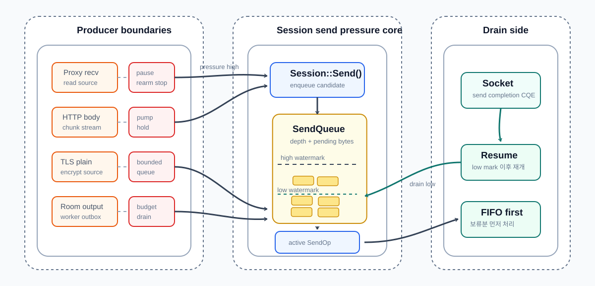


### SendQueue를 메모리 압력 측정 단위로
초기 송신 큐 방어는 주로 몇 개의 버퍼가 쌓였는지를 기준으로 삼았습니다. 하지만 큐 항목 수만으로는 실제 메모리 압력을 알 수 없습니다. 같은 10개라도 작은 패킷 10개와 256 KiB body chunk 10개는 다른 상황이었습니다. 

그래서 SendQueue 는 depth와 byte를 함께 관측합니다.

| 값 | 의미 |
| --- | --- |
| `current_depth` | 현재 대기 중인 buffer 개수 |
| `pending_bytes` | 현재 대기 중인 총 byte 수 |
| `peak_depth` | 관측된 최대 queue depth |
| `peak_pending_bytes` | 관측된 최대 pending bytes |
| `overflow_count` | 한도 초과 횟수 |

`max_pending` 같은 hard limit은 마지막 방어선입니다. 한도를 넘은 연결은 더 이상 큐잉하지 않고 정리합니다.


### write backpressure를 read 쪽으로 되돌리기
프록시는 한쪽 peer에서 받은 데이터를 반대편 peer로 전달합니다. 이때 downstream은 빠르게 읽히는데 upstream write가 느리면, 단순 중계 구조에서는 downstream recv가 계속 새로운 데이터를 만들고 반대편 send queue만 커집니다.

그래서 proxy bridge는 write-side backpressure를 read-side pause로 전파합니다.

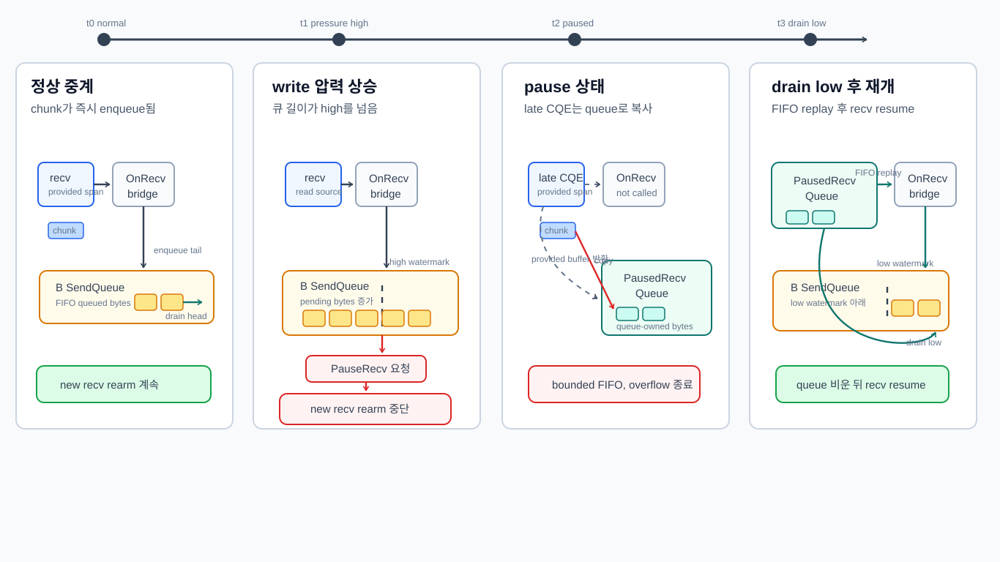

이 그림은 백프레셔의 시간 흐름과 pause 중 recv 데이터의 보존 경계를 함께 보여줍니다. B 쪽 `SendQueue`가 high watermark를 넘으면 A 쪽 새 recv 등록을 멈추고, 이미 완료되어 들어온 recv CQE의 데이터는 `PausedRecvQueue`로 복사합니다. B 쪽 write가 low watermark 아래로 내려가면 보류된 데이터를 FIFO 순서로 먼저 `OnRecv()`에 다시 전달한 뒤 recv 등록을 재개합니다.

여기서 `RecvBuffer`와 `PausedRecvQueue`는 다른 책임을 가집니다. `RecvBuffer`는 프로토콜 프레임이 조각났을 때 패킷을 조립하기 위한 세션 내부 버퍼이고, `PausedRecvQueue`는 백프레셔 때문에 `OnRecv()` 전달을 늦추는 queue-owned bounded FIFO입니다.

| 상황                          | 처리                         |
| --------------------------- | -------------------------- |
| 반대편 write가 정상적으로 drain됨     | recv를 계속 등록하고 즉시 중계        |
| 반대편 send queue가 pressure 상태 | 현재 peer의 recv를 pause       |
| socket drain 신호 도착          | 보류 데이터를 먼저 비우고 recv resume |
| 보류 queue 한도 초과              | peer 쌍을 정리                 |


### Paused recv queue: pause 이후 이미 도착한 데이터 보존
read를 pause한다고 해서 이미 완료된 recv CQE까지 사라지는 것은 아닙니다. `PauseRecv()`를 호출했더라도 커널이나 ring에서 이미 넘어온 데이터가 있을 수 있습니다.

이 데이터를 버리면 TCP 바이트 스트림이 깨집니다. 반대로 무제한으로 보관하면 pause 자체가 백프레셔 역할을 하지 못합니다. 그래서 pause 중 도착한 데이터는 `PausedRecvQueue`에 제한적으로 보존합니다.

| 상황 | 처리 |
| --- | --- |
| recv가 pause되지 않음 | 즉시 `OnRecv()`로 전달 |
| recv가 pause됨 | 도착한 chunk를 paused recv queue에 복사 |
| queue 한도 내 | resume 때 FIFO로 다시 `OnRecv()` |
| queue 한도 초과 | overflow로 disconnect |

이 경계의 목적은 성능 최적화가 아니라 스트림 보존입니다. write-side 압력이 read-side pause로 전파되더라도, 이미 도착한 바이트는 순서를 유지한 채 제한된 범위에서만 살아남습니다.


### 큰 응답을 drain 속도에 맞춰 생산
HTTP handler는 큰 JSON, 큰 text, 파일 body를 만들 수 있습니다. 이 body를 한 번에 `SendBuffer`로 만들면 두 문제가 생깁니다.

| 문제 | 이유 |
| --- | --- |
| build 실패 | body가 buffer pool chunk보다 클 수 있음 |
| slow client 앞 메모리 증가 | 큰 응답 전체가 send queue에 한 번에 들어감 |

| 기준 | 값 |
| --- | ---: |
| inline response 한계 | 256 KiB |
| body stream chunk 크기 | 256 KiB |
| 한 번에 pump하는 최대 chunk 수 | 4 |

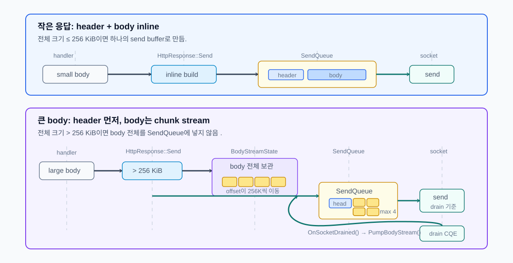

`HttpResponse::Send()`는 전체 크기가 inline 한계 이하일 때만 단일 buffer를 만듭니다. 더 큰 응답은 header를 먼저 보내고 `StartBodyStream()`으로 body를 넘깁니다.

작은 응답은 header와 body를 하나의 send buffer로 만들어 바로 `Send()`할 수 있지만, 큰 응답을 한 번에 만들면 느린 클라이언트 앞에서 send queue와 buffer pool에 큰 압력이 생깁니다. 그래서 큰 body는 먼저 header만 전송하고, body는 `BodyStreamState`에 보관한 뒤 일정 크기의 chunk로 나누어 pump합니다.

동작 흐름은 다음과 같습니다.

1. 이미 file stream이나 body stream이 진행 중이면 시작하지 않습니다.
2. body shared pointer, offset, chunk size, 한 번에 보낼 최대 chunk 수를 `body_stream_`에 저장합니다.
3. 먼저 HTTP header buffer를 `Send()`합니다.
4. header 전송 등록에 성공하면 `PumpBodyStream()`을 호출해 첫 body chunk 묶음을 큐에 넣습니다.
5. 이후 socket send가 drain될 때 `OnSocketDrained()`에서 다시 `PumpBodyStream()`을 호출해 다음 chunk를 이어 보냅니다.

이 구조로 큰 body 전체를 한 번에 `SendQueue`에 넣지 않고, `chunk_size * max_chunks_per_write` 단위로만 생산합니다. 즉 생산자인 HTTP response body stream이 소비자인 socket send 완료 속도에 맞춰 천천히 진행됩니다.

***

## 선택 모듈, 검증, 최종 정리

### 선택 모듈로 확장한 결과
최종 구조에서 Core 런타임은 특정 서버 제품이 아니라 프로토콜에 종속되지 않는 전송 계층입니다. Core는 소켓 연결 수락, 수신/송신, 제공 버퍼, 송신 큐, 시간 초과, 수명주기, owner ring 같은 공통 I/O 책임을 맡습니다. HTTP 요청 해석, 프록시 라우팅, 게임 패킷과 Room 실행 모델은 Core 밖 선택 모듈이 담당합니다.

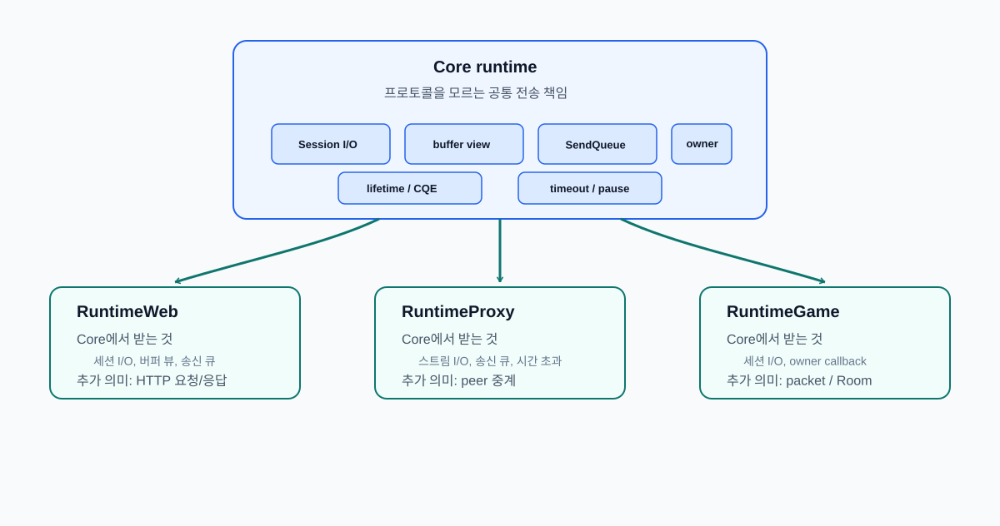

| 모듈             | Core에서 받는 것                  | 모듈이 추가하는 의미                                         | Core에 넣지 않은 것            |
| -------------- | ---------------------------- | --------------------------------------------------- | ------------------------ |
| `RuntimeWeb`   | 세션 I/O, 제공 버퍼 뷰, 송신 큐        | `HttpSession`, HTTP 파서, Router, 응답 생성               | 라우팅 정책, 인증, 파일 정책        |
| `RuntimeProxy` | 스트림 I/O, 송신 큐, 시간 초과         | downstream/upstream 중계                              | 프록시 라우팅 정책, peer별 종료 정책  |
| `RuntimeGame`  | 세션 I/O, owner callback, 송신 큐 | `PacketSession`, `PacketBuilder`, Room, RoomManager | 전투, 던전, DB, 인증 같은 게임 도메인 |


### 모듈별 검증
### RuntimeWeb
`RuntimeWeb`은 Core `Session::OnRecv()`로 올라온 바이트를 HTTP/1.1 요청으로 해석합니다. 요청 헤더와 본문을 파싱하고, Router를 통해 handler를 찾은 뒤, 응답을 Core 송신 큐로 넘깁니다.

| 검증 항목 | 확인한 것 |
| --- | --- |
| HTTP 파서와 요청 수명주기 | TCP 스트림을 HTTP 요청 단위로 해석 |
| Router / RadixTree | method, 정적 경로, parameter, wildcard route 분리 |
| 파일/스트리밍 응답 | 큰 본문을 앱 메모리에 한 번에 누적하지 않음 |
| timeout/backpressure 연결 | HTTP 의미의 요청 시간 초과와 출력 흐름 제어를 Core 경로에 연결 |

### RuntimeProxy
`RuntimeProxy`는 downstream 세션과 upstream 세션을 중계 경로로 묶습니다. HTTP 요청/응답 객체를 만들지 않고, 한쪽 peer에서 받은 바이트를 반대편 peer의 송신 큐로 전달합니다.

| 검증 항목 | 확인한 것 |
| --- | --- |
| downstream/upstream 중계 | 두 TCP 세션 사이의 바이트 전달 |
| 논블로킹 연결기 | upstream 연결 시간 초과와 실패 처리 |
| TLS/SNI 라우팅 | TLS 종료와 라우팅 선택을 Proxy 경계에 격리 |
| 느린 peer 처리 | write pressure를 반대편 recv pause/resume으로 전파 |

### RuntimeGame
`RuntimeGame`은 게임 도메인 전체가 아니라 바이너리 패킷 프레이밍과 Room 실행 모델을 제공하고, `PacketSession`은 `[size:uint16][msgId:uint16][payload]` 형식의 패킷 경계를 복원 및 완전한 패킷이 만들어졌을 때만 게임 핸들러로 넘깁니다.

| 검증 항목 | 확인한 것 |
| --- | --- |
| `PacketSession` | TCP 스트림 위 바이너리 패킷 경계 복원 |
| `PacketBuilder` | 페이로드 앞에 패킷 헤더를 붙여 Core 송신 큐로 전달 |
| `Room` / `JobQueue` | Room 상태 변경을 직렬 실행하고 Room 간 분산 허용 |
| `RoomManager` / `PlayerRegistry` | 플레이어-Room 관계와 Room 수명주기 관리 |


### 결론
Web, Proxy, Game을 각각 만들었다는 데 있지 않고, 서로 다른 프로토콜 모듈을 같은 Core 위에 올려도 내부의 수명, 버퍼, 송신 순서, 흐름 제어 문제는 바뀌지 않았습니다.

처음에는 서버의 연결 수락, 수신, 송신, 연결 종료 흐름을 직접 구현하는 문제로 시작했습니다. 하지만 구현이 진행될수록 핵심은 빠르게 I/O를 제출하는 코드가 아니라, 완료 통지가 늦게 도착하고, 버퍼 수명이 엇갈리고, 연결 종료 중 새 작업이 들어오고, 여러 워커가 같은 세션이나 Room을 건드리는 상황을 끝까지 안전하게 마무리하는 데 있다는 점이 드러났습니다.

그래서 최종 구조에서 Core는 프로토콜을 모르는 상태로 남겨 두었습니다. HTTP 요청, 프록시 라우팅, 게임 패킷의 의미는 각 모듈이 해석하고, Core는 세션 I/O 상태를 owner ring에서 직렬화합니다. 제출된 I/O는 CQE가 돌아올 때까지 생존하고, 연결 종료는 즉시 해제가 아니라 비우기 이후에 확정되는 상태 전환으로 처리됩니다. 송신 큐 역시 무제한 버퍼가 아니라 watermark, 수신 일시 정지, 연결 종료 정책을 판단하는 기준으로 사용됩니다.

결과적으로 이 구현은 단순히 빠른 서버를 만드는 작업이 아닌 완료 통지 기반 전송 런타임을 세우는 작업에 가까웠습니다. Core는 수명, 버퍼, 흐름, 동시성의 규칙을 고정하고, Web/Proxy/Game은 그 위에서 각자 프로토콜을 해석합니다. 이 경계가 유지되기 때문에 같은 런타임을 HTTP 서버, , 패킷 게임 서버로 확장할 수 있었습니다.

